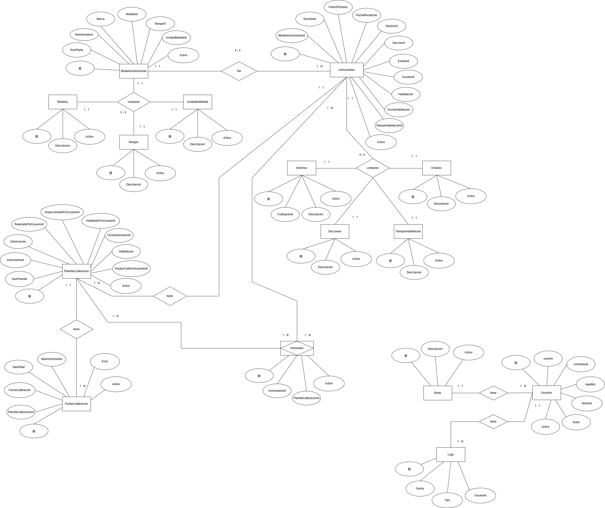
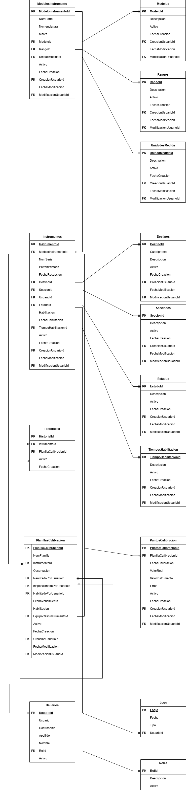

# Estructura de base de datos

## 📄Diagrama Entidad-Relación

---

## 📄Diagrama de clases

---

# 📐Diccionario de datos

| Tabla                | Columna                   | Tipo de Dato | Longitud/Precisión | Acepta Nulos | Clave Primaria | Clave Foránea | Tabla Referenciada (FK) | Columna Referenciada (FK) | Descripción |
| -------------------- | ------------------------- | ------------ | ------------------ | ------------ | -------------- | ------------- | ----------------------- | ------------------------- | ----------- |
| Destinos             | DestinoId                 | int          | NULL               | NO           | SÍ             | NO            | NULL                    | NULL                      | NULL        |
| Destinos             | Cuatrigrama               | nvarchar     | 8                  | NO           | NO             | NO            | NULL                    | NULL                      | NULL        |
| Destinos             | Activo                    | bit          | NULL               | NO           | NO             | NO            | NULL                    | NULL                      | NULL        |
| Destinos             | Descripcion               | nvarchar     | 100                | NO           | NO             | NO            | NULL                    | NULL                      | NULL        |
| Destinos             | FechaCreacion             | datetime     | NULL               | NO           | NO             | NO            | NULL                    | NULL                      | NULL        |
| Destinos             | CreacionUsuarioId         | int          | NULL               | NO           | NO             | SÍ            | Usuarios                | UsuarioId                 | NULL        |
| Destinos             | FechaModificacion         | datetime     | NULL               | SÍ           | NO             | NO            | NULL                    | NULL                      | NULL        |
| Destinos             | ModificacionUsuarioId     | int          | NULL               | SÍ           | NO             | SÍ            | Usuarios                | UsuarioId                 | NULL        |
| Estados              | EstadoId                  | int          | NULL               | NO           | SÍ             | NO            | NULL                    | NULL                      | NULL        |
| Estados              | Descripcion               | nvarchar     | 100                | NO           | NO             | NO            | NULL                    | NULL                      | NULL        |
| Estados              | Activo                    | bit          | NULL               | NO           | NO             | NO            | NULL                    | NULL                      | NULL        |
| Estados              | FechaCreacion             | datetime     | NULL               | NO           | NO             | NO            | NULL                    | NULL                      | NULL        |
| Estados              | CreacionUsuarioId         | int          | NULL               | NO           | NO             | SÍ            | Usuarios                | UsuarioId                 | NULL        |
| Estados              | FechaModificacion         | datetime     | NULL               | SÍ           | NO             | NO            | NULL                    | NULL                      | NULL        |
| Estados              | ModificacionUsuarioId     | int          | NULL               | SÍ           | NO             | SÍ            | Usuarios                | UsuarioId                 | NULL        |
| Historiales          | HistorialId               | int          | NULL               | NO           | SÍ             | NO            | NULL                    | NULL                      | NULL        |
| Historiales          | InstrumentoId             | int          | NULL               | NO           | NO             | SÍ            | Instrumentos            | InstrumentoId             | NULL        |
| Historiales          | PlanillaCalibracionId     | int          | NULL               | NO           | NO             | SÍ            | PlanillasCalibracion    | PlanillaCalibracionId     | NULL        |
| Historiales          | Activo                    | bit          | NULL               | NO           | NO             | NO            | NULL                    | NULL                      | NULL        |
| Historiales          | FechaCreacion             | datetime     | NULL               | NO           | NO             | NO            | NULL                    | NULL                      | NULL        |
| Instrumentos         | InstrumentoId             | int          | NULL               | NO           | SÍ             | NO            | NULL                    | NULL                      | NULL        |
| Instrumentos         | ModeloInstrumentoId       | int          | NULL               | NO           | NO             | SÍ            | ModelosInstrumento      | ModeloInstrumentoId       | NULL        |
| Instrumentos         | NumSerie                  | nvarchar     | 100                | NO           | NO             | NO            | NULL                    | NULL                      | NULL        |
| Instrumentos         | PatronPrimario            | bit          | NULL               | NO           | NO             | NO            | NULL                    | NULL                      | NULL        |
| Instrumentos         | FechaRecepcion            | datetime     | NULL               | NO           | NO             | NO            | NULL                    | NULL                      | NULL        |
| Instrumentos         | DestinoId                 | int          | NULL               | NO           | NO             | SÍ            | Destinos                | DestinoId                 | NULL        |
| Instrumentos         | SeccionId                 | int          | NULL               | SÍ           | NO             | SÍ            | Secciones               | SeccionId                 | NULL        |
| Instrumentos         | UsuarioId                 | int          | NULL               | NO           | NO             | SÍ            | Usuarios                | UsuarioId                 | NULL        |
| Instrumentos         | EstadoId                  | int          | NULL               | NO           | NO             | SÍ            | Estados                 | EstadoId                  | NULL        |
| Instrumentos         | Habilitacion              | bit          | NULL               | NO           | NO             | NO            | NULL                    | NULL                      | NULL        |
| Instrumentos         | FechaHabilitacion         | datetime     | NULL               | NO           | NO             | NO            | NULL                    | NULL                      | NULL        |
| Instrumentos         | TiempoHabilitacionId      | int          | NULL               | NO           | NO             | SÍ            | TiemposHabilitacion     | TiempoHabilitacionId      | NULL        |
| Instrumentos         | Activo                    | bit          | NULL               | NO           | NO             | NO            | NULL                    | NULL                      | NULL        |
| Instrumentos         | FechaCreacion             | datetime     | NULL               | NO           | NO             | NO            | NULL                    | NULL                      | NULL        |
| Instrumentos         | CreacionUsuarioId         | int          | NULL               | NO           | NO             | SÍ            | Usuarios                | UsuarioId                 | NULL        |
| Instrumentos         | FechaModificacion         | datetime     | NULL               | SÍ           | NO             | NO            | NULL                    | NULL                      | NULL        |
| Instrumentos         | ModificacionUsuarioId     | int          | NULL               | SÍ           | NO             | SÍ            | Usuarios                | UsuarioId                 | NULL        |
| Logs                 | LogId                     | int          | NULL               | NO           | SÍ             | NO            | NULL                    | NULL                      | NULL        |
| Logs                 | Fecha                     | datetime     | NULL               | NO           | NO             | NO            | NULL                    | NULL                      | NULL        |
| Logs                 | Tipo                      | nvarchar     | 100                | NO           | NO             | NO            | NULL                    | NULL                      | NULL        |
| Logs                 | UsuarioId                 | int          | NULL               | NO           | NO             | SÍ            | Usuarios                | UsuarioId                 | NULL        |
| Modelos              | ModeloId                  | int          | NULL               | NO           | SÍ             | NO            | NULL                    | NULL                      | NULL        |
| Modelos              | Descripcion               | nvarchar     | 100                | NO           | NO             | NO            | NULL                    | NULL                      | NULL        |
| Modelos              | Activo                    | bit          | NULL               | NO           | NO             | NO            | NULL                    | NULL                      | NULL        |
| Modelos              | FechaCreacion             | datetime     | NULL               | NO           | NO             | NO            | NULL                    | NULL                      | NULL        |
| Modelos              | CreacionUsuarioId         | int          | NULL               | NO           | NO             | SÍ            | Usuarios                | UsuarioId                 | NULL        |
| Modelos              | FechaModificacion         | datetime     | NULL               | SÍ           | NO             | NO            | NULL                    | NULL                      | NULL        |
| Modelos              | ModificacionUsuarioId     | int          | NULL               | SÍ           | NO             | SÍ            | Usuarios                | UsuarioId                 | NULL        |
| ModelosInstrumento   | ModeloInstrumentoId       | int          | NULL               | NO           | SÍ             | NO            | NULL                    | NULL                      | NULL        |
| ModelosInstrumento   | NumParte                  | nvarchar     | 100                | NO           | NO             | NO            | NULL                    | NULL                      | NULL        |
| ModelosInstrumento   | Nomenclatura              | nvarchar     | 100                | NO           | NO             | NO            | NULL                    | NULL                      | NULL        |
| ModelosInstrumento   | Marca                     | nvarchar     | 100                | NO           | NO             | NO            | NULL                    | NULL                      | NULL        |
| ModelosInstrumento   | ModeloId                  | int          | NULL               | NO           | NO             | SÍ            | Modelos                 | ModeloId                  | NULL        |
| ModelosInstrumento   | RangoId                   | int          | NULL               | NO           | NO             | SÍ            | Rangos                  | RangoId                   | NULL        |
| ModelosInstrumento   | UnidadMedidaId            | int          | NULL               | NO           | NO             | SÍ            | UnidadesMedida          | UnidadMedidaId            | NULL        |
| ModelosInstrumento   | Activo                    | bit          | NULL               | NO           | NO             | NO            | NULL                    | NULL                      | NULL        |
| ModelosInstrumento   | FechaCreacion             | datetime     | NULL               | NO           | NO             | NO            | NULL                    | NULL                      | NULL        |
| ModelosInstrumento   | CreacionUsuarioId         | int          | NULL               | NO           | NO             | SÍ            | Usuarios                | UsuarioId                 | NULL        |
| ModelosInstrumento   | FechaModificacion         | datetime     | NULL               | SÍ           | NO             | NO            | NULL                    | NULL                      | NULL        |
| ModelosInstrumento   | ModificacionUsuarioId     | int          | NULL               | SÍ           | NO             | SÍ            | Usuarios                | UsuarioId                 | NULL        |
| PlanillasCalibracion | PlanillaCalibracionId     | int          | NULL               | NO           | SÍ             | NO            | NULL                    | NULL                      | NULL        |
| PlanillasCalibracion | NumPlanillla              | int          | NULL               | NO           | NO             | NO            | NULL                    | NULL                      | NULL        |
| PlanillasCalibracion | InstrumentoId             | int          | NULL               | NO           | NO             | SÍ            | Instrumentos            | InstrumentoId             | NULL        |
| PlanillasCalibracion | Observacion               | nvarchar     | 1000               | SÍ           | NO             | NO            | NULL                    | NULL                      | NULL        |
| PlanillasCalibracion | RealizadoPorUsuarioId     | int          | NULL               | NO           | NO             | SÍ            | Usuarios                | UsuarioId                 | NULL        |
| PlanillasCalibracion | InspeccionadoPorUsuarioId | int          | NULL               | NO           | NO             | SÍ            | Usuarios                | UsuarioId                 | NULL        |
| PlanillasCalibracion | HabilitadoPorUsuarioId    | int          | NULL               | NO           | NO             | SÍ            | Usuarios                | UsuarioId                 | NULL        |
| PlanillasCalibracion | FechaVencimiento          | datetime     | NULL               | NO           | NO             | NO            | NULL                    | NULL                      | NULL        |
| PlanillasCalibracion | Habilitacion              | bit          | NULL               | NO           | NO             | NO            | NULL                    | NULL                      | NULL        |
| PlanillasCalibracion | EquipoCalibInstrumentoId  | int          | NULL               | NO           | NO             | SÍ            | Instrumentos            | InstrumentoId             | NULL        |
| PlanillasCalibracion | Activo                    | bit          | NULL               | NO           | NO             | NO            | NULL                    | NULL                      | NULL        |
| PlanillasCalibracion | FechaCreacion             | datetime     | NULL               | NO           | NO             | NO            | NULL                    | NULL                      | NULL        |
| PlanillasCalibracion | CreacionUsuarioId         | int          | NULL               | NO           | NO             | SÍ            | Usuarios                | UsuarioId                 | NULL        |
| PlanillasCalibracion | FechaModificacion         | datetime     | NULL               | SÍ           | NO             | NO            | NULL                    | NULL                      | NULL        |
| PlanillasCalibracion | ModificacionUsuarioId     | int          | NULL               | SÍ           | NO             | SÍ            | Usuarios                | UsuarioId                 | NULL        |
| PuntosCalibracion    | PuntoCalibracionId        | int          | NULL               | NO           | SÍ             | NO            | NULL                    | NULL                      | NULL        |
| PuntosCalibracion    | PlanillaCalibracionId     | int          | NULL               | NO           | NO             | SÍ            | PlanillasCalibracion    | PlanillaCalibracionId     | NULL        |
| PuntosCalibracion    | FechaCalibracion          | datetime     | NULL               | NO           | NO             | NO            | NULL                    | NULL                      | NULL        |
| PuntosCalibracion    | ValorReal                 | decimal      | 18,3               | NO           | NO             | NO            | NULL                    | NULL                      | NULL        |
| PuntosCalibracion    | ValorInstrumento          | decimal      | 18,3               | NO           | NO             | NO            | NULL                    | NULL                      | NULL        |
| PuntosCalibracion    | Error                     | decimal      | 18,3               | NO           | NO             | NO            | NULL                    | NULL                      | NULL        |
| PuntosCalibracion    | Activo                    | bit          | NULL               | NO           | NO             | NO            | NULL                    | NULL                      | NULL        |
| PuntosCalibracion    | FechaCreacion             | datetime     | NULL               | NO           | NO             | NO            | NULL                    | NULL                      | NULL        |
| PuntosCalibracion    | CreacionUsuarioId         | int          | NULL               | NO           | NO             | SÍ            | Usuarios                | UsuarioId                 | NULL        |
| PuntosCalibracion    | FechaModificacion         | datetime     | NULL               | SÍ           | NO             | NO            | NULL                    | NULL                      | NULL        |
| PuntosCalibracion    | ModificacionUsuarioId     | int          | NULL               | SÍ           | NO             | SÍ            | Usuarios                | UsuarioId                 | NULL        |
| Rangos               | RangoId                   | int          | NULL               | NO           | SÍ             | NO            | NULL                    | NULL                      | NULL        |
| Rangos               | Descripcion               | nvarchar     | 100                | NO           | NO             | NO            | NULL                    | NULL                      | NULL        |
| Rangos               | Activo                    | bit          | NULL               | NO           | NO             | NO            | NULL                    | NULL                      | NULL        |
| Rangos               | FechaCreacion             | datetime     | NULL               | NO           | NO             | NO            | NULL                    | NULL                      | NULL        |
| Rangos               | CreacionUsuarioId         | int          | NULL               | NO           | NO             | SÍ            | Usuarios                | UsuarioId                 | NULL        |
| Rangos               | FechaModificacion         | datetime     | NULL               | SÍ           | NO             | NO            | NULL                    | NULL                      | NULL        |
| Rangos               | ModificacionUsuarioId     | int          | NULL               | SÍ           | NO             | SÍ            | Usuarios                | UsuarioId                 | NULL        |
| Roles                | RolId                     | int          | NULL               | NO           | SÍ             | NO            | NULL                    | NULL                      | NULL        |
| Roles                | Descripcion               | nvarchar     | 100                | NO           | NO             | NO            | NULL                    | NULL                      | NULL        |
| Roles                | Activo                    | bit          | NULL               | NO           | NO             | NO            | NULL                    | NULL                      | NULL        |
| Secciones            | SeccionId                 | int          | NULL               | NO           | SÍ             | NO            | NULL                    | NULL                      | NULL        |
| Secciones            | Descripcion               | nvarchar     | 100                | NO           | NO             | NO            | NULL                    | NULL                      | NULL        |
| Secciones            | Activo                    | bit          | NULL               | NO           | NO             | NO            | NULL                    | NULL                      | NULL        |
| Secciones            | FechaCreacion             | datetime     | NULL               | NO           | NO             | NO            | NULL                    | NULL                      | NULL        |
| Secciones            | CreacionUsuarioId         | int          | NULL               | NO           | NO             | SÍ            | Usuarios                | UsuarioId                 | NULL        |
| Secciones            | FechaModificacion         | datetime     | NULL               | SÍ           | NO             | NO            | NULL                    | NULL                      | NULL        |
| Secciones            | ModificacionUsuarioId     | int          | NULL               | SÍ           | NO             | SÍ            | Usuarios                | UsuarioId                 | NULL        |
| sysdiagrams          | name                      | sysname      | NULL               | NO           | NO             | NO            | NULL                    | NULL                      | NULL        |
| sysdiagrams          | principal_id              | int          | NULL               | NO           | NO             | NO            | NULL                    | NULL                      | NULL        |
| sysdiagrams          | diagram_id                | int          | NULL               | NO           | SÍ             | NO            | NULL                    | NULL                      | NULL        |
| sysdiagrams          | version                   | int          | NULL               | SÍ           | NO             | NO            | NULL                    | NULL                      | NULL        |
| sysdiagrams          | definition                | varbinary    | NULL               | SÍ           | NO             | NO            | NULL                    | NULL                      | NULL        |
| TiemposHabilitacion  | TiempoHabilitacionId      | int          | NULL               | NO           | SÍ             | NO            | NULL                    | NULL                      | NULL        |
| TiemposHabilitacion  | Descripcion               | nvarchar     | 100                | NO           | NO             | NO            | NULL                    | NULL                      | NULL        |
| TiemposHabilitacion  | Activo                    | bit          | NULL               | NO           | NO             | NO            | NULL                    | NULL                      | NULL        |
| TiemposHabilitacion  | FechaCreacion             | datetime     | NULL               | NO           | NO             | NO            | NULL                    | NULL                      | NULL        |
| TiemposHabilitacion  | CreacionUsuarioId         | int          | NULL               | NO           | NO             | SÍ            | Usuarios                | UsuarioId                 | NULL        |
| TiemposHabilitacion  | FechaModificacion         | datetime     | NULL               | SÍ           | NO             | NO            | NULL                    | NULL                      | NULL        |
| TiemposHabilitacion  | ModificacionUsuarioId     | int          | NULL               | SÍ           | NO             | SÍ            | Usuarios                | UsuarioId                 | NULL        |
| UnidadesMedida       | UnidadMedidaId            | int          | NULL               | NO           | SÍ             | NO            | NULL                    | NULL                      | NULL        |
| UnidadesMedida       | Descripcion               | nvarchar     | 100                | NO           | NO             | NO            | NULL                    | NULL                      | NULL        |
| UnidadesMedida       | Activo                    | bit          | NULL               | NO           | NO             | NO            | NULL                    | NULL                      | NULL        |
| UnidadesMedida       | FechaCreacion             | datetime     | NULL               | NO           | NO             | NO            | NULL                    | NULL                      | NULL        |
| UnidadesMedida       | CreacionUsuarioId         | int          | NULL               | NO           | NO             | SÍ            | Usuarios                | UsuarioId                 | NULL        |
| UnidadesMedida       | FechaModificacion         | datetime     | NULL               | SÍ           | NO             | NO            | NULL                    | NULL                      | NULL        |
| UnidadesMedida       | ModificacionUsuarioId     | int          | NULL               | SÍ           | NO             | SÍ            | Usuarios                | UsuarioId                 | NULL        |
| Usuarios             | UsuarioId                 | int          | NULL               | NO           | SÍ             | NO            | NULL                    | NULL                      | NULL        |
| Usuarios             | Usuario                   | nvarchar     | 100                | NO           | NO             | NO            | NULL                    | NULL                      | NULL        |
| Usuarios             | Contrasenia               | varchar      | 255                | NO           | NO             | NO            | NULL                    | NULL                      | NULL        |
| Usuarios             | Apellido                  | nvarchar     | 100                | NO           | NO             | NO            | NULL                    | NULL                      | NULL        |
| Usuarios             | Nombre                    | nvarchar     | 100                | NO           | NO             | NO            | NULL                    | NULL                      | NULL        |
| Usuarios             | RolId                     | int          | NULL               | NO           | NO             | SÍ            | Roles                   | RolId                     | NULL        |
| Usuarios             | Activo                    | bit          | NULL               | NO           | NO             | NO            | NULL                    | NULL                      | NULL        |
