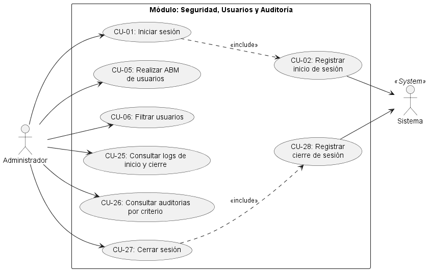
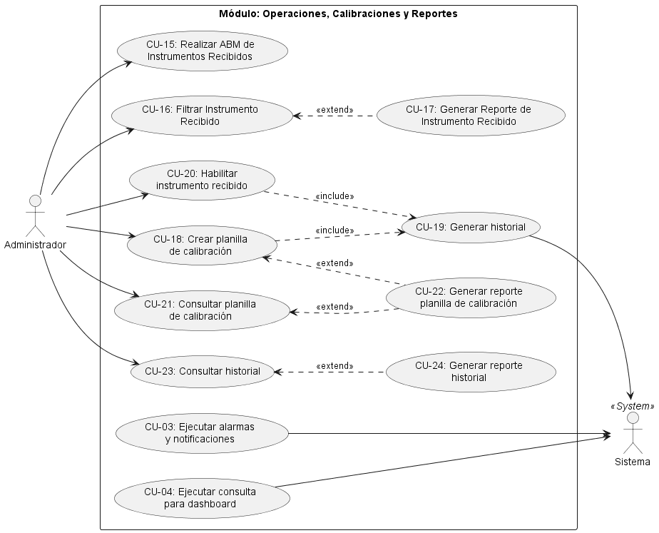

# Casos de usos

## 🔑 Rol administrador

---

## 🛠️ Rol Técnico

---

## 🧑‍🔧 Rol cliente

---

# Planilla de especificación

## 🔑 Rol Administrador

## Especificación de caso de uso: CU-01

| Campo                               | Descripción                                                                                                                                          |
|:----------------------------------- |:---------------------------------------------------------------------------------------------------------------------------------------------------- |
| **Nombre del Caso de Uso**          | Iniciar sesión                                                                                                                                       |
| **Actor Principal**                 | Administrador                                                                                                                                        |
| **Actores Secundarios**             | Sistema (*Incluye Registrar inicio de sesión*)                                                                                                       |
| **Breve descripción**               | El administrador ingresa sus credenciales para ingresar al sistema.                                                                                  |
| **Precondiciones**                  | 1. El usuario debe estar dado de alta en el sistema. (*Por default*).                                                                                |
| **Flujo Principal**                 | 1. El actor ingresa sus credenciales para entrar al sistema.                                                                                         |
|                                     | 2. (*Inclusión*) El sistema invoca el caso de uso **"Registrar inicio de sesión".**                                                                  |
|                                     | 3. El actor es rediregido a la pantalla por defecto.                                                                                                 |
| **Flujos Alternativos/Excepciones** | `include`: *El sistema registra el inicio de sesión:* el sistema ejecuta la funcionalidad de registrar el inicio de sesión con los datos requeridos. |
| **Postcondiciones**                 | La redirección a la pantalla default se realiza y queda registrado el inicio de sesión.                                                              |

## Especificación de caso de uso: CU-02 (*CU-Sistema*)

| Campo                               | Descripción                                                           |
| ----------------------------------- | --------------------------------------------------------------------- |
| **Nombre del Caso de Uso**          | Registrar inicio de sesión                                            |
| **Actor Principal**                 | Sistema                                                               |
| **Actores Secundarios**             | -                                                                     |
| **Breve descripción**               | El sistema realiza el registro de datos de inicio de sesión.          |
| **Precondiciones**                  | 1. El usuario, para registrar logs, debe estar dado de alta y activo. |
| **Flujo Principal**                 | 1. Es llamado desde el CU-01: *Iniciar sesión*.                       |
|                                     | 2. Realiza la acción automatizada.                                    |
| **Flujos Alternativos/Excepciones** | -                                                                     |
| **Postcondiciones**                 | El registro de inicio de sesión queda realizado.                      |

## Especificación de caso de uso: CU-03 (*CU-Sistema*)

| Campo                               | Descripción                                                                              |
| ----------------------------------- | ---------------------------------------------------------------------------------------- |
| **Nombre del Caso de Uso**          | Ejecutar alarmas y notificaciones                                                        |
| **Actor Principal**                 | Sistema                                                                                  |
| **Actores Secundarios**             | -                                                                                        |
| **Breve descripción**               | El sistema realiza el llamado a la ejecución de alarmas y notificaciones.                |
| **Precondiciones**                  | 1. El usuario debe estar dado de alta.                                                   |
|                                     | 2. Los insturmentos respectivos deben estar dados de alta.                               |
| **Flujo Principal**                 | 1. Es llamado luego de la realización del CU-01: *iniciar sesión*.                       |
|                                     | 2. Realiza la acción automatizada.                                                       |
| **Flujos Alternativos/Excepciones** | -                                                                                        |
| **Postcondiciones**                 | Las alarmas y notificaciones fueron ejecutadas. Se muestra actualización de información. |

## Especificación de caso de uso: CU-04 (*CU-Sistema*)

| Campo                               | Descripción                                                                                                |
| ----------------------------------- | ---------------------------------------------------------------------------------------------------------- |
| **Nombre del Caso de Uso**          | Ejecutar consulta para dashboard                                                                           |
| **Actor Principal**                 | Sistema                                                                                                    |
| **Actores Secundarios**             | -                                                                                                          |
| **Breve descripción**               | El sistema realiza las consultas necesarias para actualizar la información que se quiere mostrar.          |
| **Precondiciones**                  | 1. El usuario debe estar dado de alta.                                                                     |
|                                     | 2. Los insturmentos respectivos deben estar dados de alta.                                                 |
| **Flujo Principal**                 | 1. Es llamado luego de la realización del CU-01: *iniciar sesión*.                                         |
|                                     | 2. Realiza la acción automatizada.                                                                         |
| **Flujos Alternativos/Excepciones** | -                                                                                                          |
| **Postcondiciones**                 | Las consultas y actualiación de información quedan ejecutadas. Se ejecuta la actualización de información. |

## Especificación de caso de uso: CU-05

| Campo                               | Descripción                                                                                                                       |
| ----------------------------------- | --------------------------------------------------------------------------------------------------------------------------------- |
| **Nombre del Caso de Uso**          | Realizar ABM de usuarios                                                                                                          |
| **Actor Principal**                 | Administrador                                                                                                                     |
| **Actores Secundarios**             | *Sistema (Incluye Hash de contraseña)*                                                                                            |
| **Breve descripción**               | El Administrador puede realizar las acciones: dar de alta, modificar y/o baja de los tipos de usuarios que utilizaran el sistema. |
| **Precondiciones**                  | 1. Rol Administrador activo.                                                                                                      |
| **Flujo Principal**                 | 1. El actor ingresa los datos correspondientes al usuario a registrar.                                                            |
|                                     | 2. El actor guarda los cambios.                                                                                                   |
| **Flujos Alternativos/Excepciones** | 2a. El actor puede cancelar.                                                                                                      |
| **Postcondiciones**                 | Queda realizada la acción ABM.                                                                                                    |

## Especificación de caso de uso: CU-06

| Campo                               | Descripción                                                                              |
| ----------------------------------- | ---------------------------------------------------------------------------------------- |
| **Nombre del Caso de Uso**          | Filtrar usuarios                                                                         |
| **Actor Principal**                 | Administrador                                                                            |
| **Actores Secundarios**             | -                                                                                        |
| **Breve descripción**               | El Administrador puede realizar filtros por criterio de usuarios que utilizan el sitema. |
| **Precondiciones**                  | 1. El usuario, a filtrar, debe estar dado de alta y activo.(CU-05)                       |
| **Flujo Principal**                 | 1. El actor selecta las opciones para configurar el filtro.                              |
|                                     | 2. El actor ejecuta el filtro.                                                           |
| **Flujos Alternativos/Excepciones** | -                                                                                        |
| **Postcondiciones**                 | El filtro queda realizado y se muestra el resultado.                                     |

## Especificación de caso de uso: CU-07

| Campo                               | Descripción                                                                                                                                |
| ----------------------------------- | ------------------------------------------------------------------------------------------------------------------------------------------ |
| **Nombre del Caso de Uso**          | Realizar ABM de modelos de instrumento                                                                                                     |
| **Actor Principal**                 | Administrador                                                                                                                              |
| **Actores Secundarios**             | -                                                                                                                                          |
| **Breve descripción**               | El Administrador puede realizar las acciones: dar de alta, modificar y/o baja de los modelos de instrumentos que se utilizarán el sistema. |
| **Precondiciones**                  | 1. Rol Administrador activo.                                                                                                               |
| **Flujo Principal**                 | 1. El actor ingresa los datos correspondientes a los modelos de instrumento a registrar.                                                   |
|                                     | 2. El actor guarda los cambios.                                                                                                            |
| **Flujos Alternativos/Excepciones** | 2a. El actor puede cancelar.                                                                                                               |
| **Postcondiciones**                 | Queda realizada la acción ABM.                                                                                                             |

## Especificación de caso de uso: CU-08

| Campo                               | Descripción                                                                                                   |
| ----------------------------------- | ------------------------------------------------------------------------------------------------------------- |
| **Nombre del Caso de Uso**          | Filtrar modelos de instrumento                                                                                |
| **Actor Principal**                 | Administrador                                                                                                 |
| **Actores Secundarios**             | -                                                                                                             |
| **Breve descripción**               | El Administrador puede realizar filtros por criterio de los modelos de instrumento que se utilizan el sitema. |
| **Precondiciones**                  | 1. El modelo de instrumento, a filtrar, debe estar dado de alta y activa. (*CU-07*)                           |
| **Flujo Principal**                 | 1. El actor selecta las opciones para configurar el filtro.                                                   |
|                                     | 2. El actor ejecuta el filtro.                                                                                |
| **Flujos Alternativos/Excepciones** | -                                                                                                             |
| **Postcondiciones**                 | El filtro queda realizado y se muestra el resultado.                                                          |

## Especificación de caso de uso: CU-09

| Campo                               | Descripción                                                                                                                           |
| ----------------------------------- | ------------------------------------------------------------------------------------------------------------------------------------- |
| **Nombre del Caso de Uso**          | Realizar ABM de unidades de medida                                                                                                    |
| **Actor Principal**                 | Administrador                                                                                                                         |
| **Actores Secundarios**             | -                                                                                                                                     |
| **Breve descripción**               | El Administrador puede realizar las acciones: dar de alta, modificar y/o baja de las unidades de medida que se utilizarán el sistema. |
| **Precondiciones**                  | 1. Rol Administrador activo.                                                                                                          |
| **Flujo Principal**                 | 1. El actor ingresa los datos correspondientes a la unidad de medida a registrar.                                                     |
|                                     | 2. El actor guarda los cambios.                                                                                                       |
| **Flujos Alternativos/Excepciones** | 2a. El actor puede cancelar.                                                                                                          |
| **Postcondiciones**                 | Queda realizada la acción ABM.                                                                                                        |

## Especificación de caso de uso: CU-10

| Campo                               | Descripción                                                                                            |
| ----------------------------------- | ------------------------------------------------------------------------------------------------------ |
| **Nombre del Caso de Uso**          | Filtrar unidades de medidas                                                                            |
| **Actor Principal**                 | Administrador                                                                                          |
| **Actores Secundarios**             | -                                                                                                      |
| **Breve descripción**               | El Administrador puede realizar filtros por criterio de unidades de medidas que se utilizan el sitema. |
| **Precondiciones**                  | 1. La unidad de medida, a filtrar, debe estar dada de alta y activa. (*CU-09*)                         |
| **Flujo Principal**                 | 1. El actor selecta las opciones para configurar el filtro.                                            |
|                                     | 2. El actor ejecuta el filtro.                                                                         |
| **Flujos Alternativos/Excepciones** | -                                                                                                      |
| **Postcondiciones**                 | El filtro queda realizado y se muestra el resultado.                                                   |

## Especificación de caso de uso: CU-11

| Campo                               | Descripción                                                                                                                              |
| ----------------------------------- | ---------------------------------------------------------------------------------------------------------------------------------------- |
| **Nombre del Caso de Uso**          | Realizar ABM  de rangos de medición                                                                                                      |
| **Actor Principal**                 | Administrador                                                                                                                            |
| **Actores Secundarios**             | -                                                                                                                                        |
| **Breve descripción**               | El Administrador puede realizar las acciones: dar de alta, modificar y/o baja de los rangos de medición que se utilizarán en el sistema. |
| **Precondiciones**                  | 1. Rol Administrador activo.                                                                                                             |
| **Flujo Principal**                 | 1. El actor ingresa los datos correspondientes al rango de medición a registrar.                                                         |
|                                     | 2. El actor guarda los cambios.                                                                                                          |
| **Flujos Alternativos/Excepciones** | 2a. El actor puede cancelar.                                                                                                             |
| **Postcondiciones**                 | Queda realizada la acción ABM.                                                                                                           |

## Especificación de caso de uso: CU-12

| Campo                               | Descripción                                                                                               |
| ----------------------------------- | --------------------------------------------------------------------------------------------------------- |
| **Nombre del Caso de Uso**          | Filtrar rangos de medición                                                                                |
| **Actor Principal**                 | Administrador                                                                                             |
| **Actores Secundarios**             | -                                                                                                         |
| **Breve descripción**               | El Administrador puede realizar filtros por criterio de rangos de medición que se utilizan en el sistema. |
| **Precondiciones**                  | 1. El rango de medición, a filtrar, debe estar dado de alta y activo. (*CU-11*)                           |
| **Flujo Principal**                 | 1. El actor selecta las opciones para configurar el filtro.                                               |
|                                     | 2. El actor ejecuta el filtro.                                                                            |
| **Flujos Alternativos/Excepciones** | -                                                                                                         |
| **Postcondiciones**                 | El filtro queda realizado y se muestra el resultado.                                                      |

## Especificación de caso de uso: CU-13

| Campo                               | Descripción                                                                                                                    |
| ----------------------------------- | ------------------------------------------------------------------------------------------------------------------------------ |
| **Nombre del Caso de Uso**          | Realizar ABM de destinos                                                                                                       |
| **Actor Principal**                 | Administrador                                                                                                                  |
| **Actores Secundarios**             | -                                                                                                                              |
| **Breve descripción**               | El Administrador puede realizar las acciones: dar de alta, modificar y/o baja de los destinos que se utilizarán en el sistema. |
| **Precondiciones**                  | 1. Rol Administrador activo.                                                                                                   |
| **Flujo Principal**                 | 1. El actor ingresa los datos correspondientes al destino a registrar.                                                         |
|                                     | 2. El actor guarda los cambios.                                                                                                |
| **Flujos Alternativos/Excepciones** | 2a. El actor puede cancelar.                                                                                                   |
| **Postcondiciones**                 | Queda realizada la acción ABM.                                                                                                 |

## Especificación de caso de uso: CU-14

| Campo                               | Descripción                                                                                     |
| ----------------------------------- | ----------------------------------------------------------------------------------------------- |
| **Nombre del Caso de Uso**          | Filtrar destino                                                                                 |
| **Actor Principal**                 | Administrador                                                                                   |
| **Actores Secundarios**             | -                                                                                               |
| **Breve descripción**               | El Administrador puede realizar filtros por criterio de destinos que se utilizan en el sistema. |
| **Precondiciones**                  | 1. El destino, a filtrar, debe estar dado de alta y activo. (*CU-13*)                           |
| **Flujo Principal**                 | 1. El actor selecta las opciones para configurar el filtro.                                     |
|                                     | 2. El actor ejecuta el filtro.                                                                  |
| **Flujos Alternativos/Excepciones** | -                                                                                               |
| **Postcondiciones**                 | El filtro queda realizado y se muestra el resultado.                                            |

## Especificación de caso de uso: CU-15

| Campo                               | Descripción                                                                                                                                             |
| ----------------------------------- | ------------------------------------------------------------------------------------------------------------------------------------------------------- |
| **Nombre del Caso de Uso**          | Realizar ABM de instrumentos recibidos                                                                                                                  |
| **Actor Principal**                 | Administrador                                                                                                                                           |
| **Actores Secundarios**             | -                                                                                                                                                       |
| **Breve descripción**               | El Administrador puede realizar las acciones: dar de alta, modificar y/o baja de los instrumentos que se procesarán en el sistema para su trazabilidad. |
| **Precondiciones**                  | 1. Rol Administrador activo.                                                                                                                            |
|                                     | 2. El modelo de instrumento debe estar dado de alta en el sistema. (*CU-07*)                                                                            |
| **Flujo Principal**                 | 1. El actor ingresa los datos correspondientes al instrumento a registrar.                                                                              |
|                                     | 2. El actor guarda los cambios.                                                                                                                         |
| **Flujos Alternativos/Excepciones** | 2a. El actor puede cancelar.                                                                                                                            |
| **Postcondiciones**                 | Queda realizada la acción ABM.                                                                                                                          |

## Especificación de caso de uso: CU-16

| Campo                               | Descripción                                                                                         |
| ----------------------------------- | --------------------------------------------------------------------------------------------------- |
| **Nombre del Caso de Uso**          | Filtrar instrumento recibido                                                                        |
| **Actor Principal**                 | Administrador                                                                                       |
| **Actores Secundarios**             | -                                                                                                   |
| **Precondiciones**                  | 1. El instrumento, a filtrar, debe estar dado de alta. (*CU-07*)                                    |
| **Breve descripción**               | El Administrador puede realizar filtros por criterio de instrumentos que se utilizan en el sistema. |
| **Flujo Principal**                 | 1. El actor selecta las opciones para configurar el filtro.                                         |
|                                     | 2. El actor ejecuta el filtro.                                                                      |
| **Flujos Alternativos/Excepciones** | -                                                                                                   |
| **Postcondiciones**                 | El filtro queda realizado y se muestra el resultado.                                                |

## Especificación de caso de uso: CU-17 (*extend de CU-16* )

| Campo                               | Descripción                                                                       |
| ----------------------------------- | --------------------------------------------------------------------------------- |
| **Nombre del Caso de Uso**          | Generar reporte de instrumento recibido                                           |
| **Actor Principal**                 | Administrador                                                                     |
| **Actores Secundarios**             | -                                                                                 |
| **Breve descripción**               | El administrador tiene la opción de realizar un reporte del instrumento recibido. |
| **Precondiciones**                  | 1. El instrumento recibido debe estar dado de alta.                               |
| **Flujo Principal**                 | 1. El actor selecciona la opción de "Generar reporte"                             |
| **Flujos Alternativos/Excepciones** | -                                                                                 |
| **Postcondiciones**                 | El reporte queda generado.                                                        |

## Especificación de caso de uso: CU-18

| Campo                               | Descripción                                                                                                                 |
| ----------------------------------- | --------------------------------------------------------------------------------------------------------------------------- |
| **Nombre del Caso de Uso**          | Crear planilla de calibración                                                                                               |
| **Actor Principal**                 | Administrador                                                                                                               |
| **Actores Secundarios**             | -                                                                                                                           |
| **Precondiciones**                  | El instrumento recibido debe estar ingresado en el sistema.(*CU-15*)                                                        |
| **Breve descripción**               | El Administrador crea la planilla de calibración con los datos correspondientes a la medición.                              |
| **Flujo Principal**                 | 1. El actor selecciona el instrumento a medir con sus campos requeridos.                                                    |
|                                     | 2. El actor completa los datos de medición.                                                                                 |
|                                     | 3. El actor completa los datos de los responsables.                                                                         |
|                                     | 4. El actor selecta habilitación.                                                                                           |
|                                     | 5. El actor completa dato de vencimiento.                                                                                   |
|                                     | 6. El actor ejecuta la generación de la planilla de calibración.                                                            |
|                                     | 7. `include`: El sistema genera el historial del instrumento. (*CU-Sistema*)                                                |
| **Flujos Alternativos/Excepciones** | 4a. El actor selecta inhabilitación.                                                                                        |
|                                     | 5a. El sistema no valida dato de vencimiento.                                                                               |
|                                     | 6a. El actor ejecuta la generación de la planilla de calibración.                                                           |
|                                     | 7a. El sistema genera el historial del instrumento. (*CU-Sistema*).                                                         |
|                                     | 7b. El sistema genera el log de habilitación del instrumento. (*CU-Sistema*).                                               |
|                                     | 8. `extend`: *Generar reporte planilla de calibración*: es posible generar un reporte de planilla de calibración. (*CU-22*) |
|                                     | 8. `include`: Generar historial.(CU--)                                                                                      |
| **Postcondiciones**                 | Queda generada la planilla de calibración y el historial de instrumento.                                                    |

## Especificación de caso de uso: CU-19 (*CU-Sistema*)

| Campo                               | Descripción                                                                                  |
| ----------------------------------- | -------------------------------------------------------------------------------------------- |
| **Nombre del Caso de Uso**          | Generar historial                                                                            |
| **Actor Principal**                 | Sistema                                                                                      |
| **Actores Secundarios**             | -                                                                                            |
| **Breve descripción**               | El sistema realiza la generación del historial.                                              |
| **Precondiciones**                  | 1. Debe estar creada la planilla de calibración.(*CU-18*)                                    |
| **Flujo Principal**                 | 1. Es ejecutado por el sistema cuando se realiza el Habilitar instrumento recibido(*CU-20*). |
| **Flujos Alternativos/Excepciones** | -                                                                                            |
| **Postcondiciones**                 | El registro de inicio de sesión queda realizado.                                             |

## Especificación de caso de uso: CU-20

| Campo                               | Descripción                                                                                |
| ----------------------------------- | ------------------------------------------------------------------------------------------ |
| **Nombre del Caso de Uso**          | Habilitar instrumento recibido.                                                            |
| **Actor Principal**                 | Administrador                                                                              |
| **Actores Secundarios**             | -                                                                                          |
| **Precondiciones**                  | 1. El modelo de instrumento debe estar dado de alta en el sistema. (*CU-07*)               |
|                                     | 2. El instrumento recibido debe estar ingresado en el sistema.(*CU-15*)                    |
| **Breve descripción**               | El Administrador puede realizar la acción: habilitar/no habilitar el instrumento recibido. |
| **Flujo Principal**                 | 1. El actor selecciona la opción correspondiente para habilitar el instrumento recibido.   |
|                                     | 2. El actor guarda los cambios.                                                            |
| **Flujos Alternativos/Excepciones** | 2a. El actor puede cancelar.                                                               |
| **Postcondiciones**                 | Queda realizada la acción de habilitar/no habilitar al instrumento recibido.               |

## Especificación de caso de uso: CU-21

| Campo                               | Descripción                                                                                                                |
| ----------------------------------- | -------------------------------------------------------------------------------------------------------------------------- |
| **Nombre del Caso de Uso**          | Consultar planilla de calibración                                                                                          |
| **Actor Principal**                 | Administrador                                                                                                              |
| **Actores Secundarios**             | -                                                                                                                          |
| **Precondiciones**                  | 1. Planilla de calibración debe estar creada. (*CU-18*)                                                                    |
| **Breve descripción**               | El Administrador realiza una consulta para ubicar la planilla desada.                                                      |
| **Flujo Principal**                 | 1. El actor selecciona la opción de "Buscar planilla".                                                                     |
|                                     | 2. El actor ingresa el dato requerido para la búsqueda.                                                                    |
|                                     | 3. El actor ejecuta la búsqueda.                                                                                           |
| **Flujos Alternativos/Excepciones** | 4. `extend`: *Generar reporte planilla de calibración:* es posible generar un reporte de planilla de clibración. (*CU-22*) |
| **Postcondiciones**                 | La búqueda queda realizada y se muestra la planilla de calibración.                                                        |

## Especificación de caso de uso: CU-22 (*extend de CU-18 o CU-21*)

| Campo                               | Descripción                                                                       |
| ----------------------------------- | --------------------------------------------------------------------------------- |
| **Nombre del Caso de Uso**          | Generar reporte planilla de calibración                                           |
| **Actor Principal**                 | Administrador                                                                     |
| **Actores Secundarios**             | -                                                                                 |
| **Breve descripción**               | El administrador tiene la opción de realizar un reporte del instrumento recibido. |
| **Precondiciones**                  | 1. La planillla de calibración debe estar generada.(CU-16)                        |
|                                     | 2. O, la consulta de planilla de calibración debe estar generada.(CU-17)          |
| **Flujo Principal**                 | 1. El actor selecciona la opción de "Generar reporte".                            |
| **Flujos Alternativos/Excepciones** | -                                                                                 |
| **Postcondiciones**                 | El reporte queda generado.                                                        |

## Especificación de caso de uso: CU-23

| Campo                               | Descripción                                                                                                                 |
| ----------------------------------- | --------------------------------------------------------------------------------------------------------------------------- |
| **Nombre del Caso de Uso**          | Consultar historial                                                                                                         |
| **Actor Principal**                 | Administrador                                                                                                               |
| **Actores Secundarios**             | -                                                                                                                           |
| **Precondiciones**                  | 1. El historial debe estar creado por el sistema. (*CU-19*)                                                                 |
| **Breve descripción**               | El Administrador realiza una consulta para ubicar el historial desada.                                                      |
| **Flujo Principal**                 | 1. El actor selecciona la opción de "Buscar historial".                                                                     |
|                                     | 2. El actor ingresa el dato requerido para la búsqueda.                                                                     |
|                                     | 3. El actor ejecuta la búsqueda.                                                                                            |
| **Flujos Alternativos/Excepciones** | 1. `extend`: *Generar reporte historial de instrumento*: es posible generar un reporte de planilla de clibración. (*CU-24*) |
| **Postcondiciones**                 | La búqueda queda realizada y se muestra el historial.                                                                       |

## Especificación de caso de uso: CU-24 (*extend de CU-23*)

| Campo                               | Descripción                                                                                            |
| ----------------------------------- | ------------------------------------------------------------------------------------------------------ |
| **Nombre del Caso de Uso**          | Generar reporte historial de instrumento                                                               |
| **Actor Principal**                 | Administrador                                                                                          |
| **Actores Secundarios**             | -                                                                                                      |
| **Breve descripción**               | El administrador tiene lo opción de realizar un reporte del instrumento recibido.                      |
| **Precondiciones**                  | 1.Consultar historial debe realizarse primero.(*CU-18*)                                                |
|                                     | 2. Para la realización de la consulta es necesario que el sistema haya generado el historial (*CU-19*) |
| **Flujo Principal**                 | 1. El actor selecciona la opción de "Generar reporte".                                                 |
| **Flujos Alternativos/Excepciones** | -                                                                                                      |
| **Postcondiciones**                 | El reporte queda generado.                                                                             |

## Especificación de caso de uso: CU-25

| Campo                               | Descripción                                                         |
| ----------------------------------- | ------------------------------------------------------------------- |
| **Nombre del Caso de Uso**          | Consultar logs de inicio y cierre de sesión                         |
| **Actor Principal**                 | Administrador                                                       |
| **Actores Secundarios**             | -                                                                   |
| **Breve descripción**               | El Administrador consulta los logs de inicio de sesión al sistema.  |
| **Precondiciones**                  | 1. Rol Administrador activo.                                        |
| **Flujo Principal**                 | 1. El actor selecta la opción de "ver logs".                        |
|                                     | 2. El actor selecta las opciones para configurar el filtro.         |
|                                     | 4. El actor ejecuta el filtro.                                      |
| **Flujos Alternativos/Excepciones** | -                                                                   |
| **Postcondiciones**                 | 1.Se genera y muestra el listado de logs, con su respectivo filtro. |

> El filtro puede cosiderar como default "últimos 10 dias" o "semana anterior"

## Especificación de caso de uso: CU-26

| Campo                               | Descripción                                                                                                                                                          |
| ----------------------------------- | -------------------------------------------------------------------------------------------------------------------------------------------------------------------- |
| **Nombre del Caso de Uso**          | Consultar auditorias por criterio                                                                                                                                    |
| **Actor Principal**                 | Administrador                                                                                                                                                        |
| **Actores Secundarios**             | -                                                                                                                                                                    |
| **Breve descripción**               | El Administrador hace consulta de auditorías, como habilitaciones, cantidad de intrumentos fuera de servicio, elementos por destino que se realizaron en el sistema. |
| **Precondiciones**                  | 1. Rol Administrador activo.                                                                                                                                         |
| **Flujo Principal**                 | 1. El actor selecta la opción de "Auditorias".                                                                                                                       |
|                                     | 2. El actor selecta las opciones para configurar el filtro.                                                                                                          |
|                                     | 3. El actor ejecuta el filtro.                                                                                                                                       |
| **Flujos Alternativos/Excepciones** | -                                                                                                                                                                    |
| **Postcondiciones**                 | 1. Se genera y muestra el listado de resultados, con su respectivo filtro.                                                                                           |

## Especificación de caso de uso: CU-27

| Campo                               | Descripción                                                                                                                                                    |
|:----------------------------------- |:-------------------------------------------------------------------------------------------------------------------------------------------------------------- |
| **Nombre del Caso de Uso**          | Cerrar sesión                                                                                                                                                  |
| **Actor Principal**                 | Administrador                                                                                                                                                  |
| **Actores Secundarios**             | Sistema (*Incluye Registrar cierre de sesión*)                                                                                                                 |
| **Breve descripción**               | El administrador ingresa sus credenciales para ingresar al sistema.                                                                                            |
| **Precondiciones**                  | 1. El usuario debe estar dado de alta en el sistema. (*Por default*)                                                                                           |
| **Flujo Principal**                 | 1. El actor ejecuta la funcionalidad de cerrar sesión.                                                                                                         |
|                                     | 2. (*Inclusión*) El sistema invoca el caso de uso **"Registrar cierre de sesión".**                                                                            |
|                                     | 3. El actor es rediregido a la pantalla de login.                                                                                                              |
| **Flujos Alternativos/Excepciones** | `include`: *El sistema registra el cierre de sesión:* el sistema ejecuta la funcionalidad de registrar los logs del cierre de sesión con los datos requeridos. |
| **Postcondiciones**                 | La redirección a la pantalla loginse realiza y queda registrado el cierre de sesión.                                                                           |

## Especificación de caso de uso: CU-28 (*CU-Sistema*)

| Campo                               | Descripción                                                           |
| ----------------------------------- | --------------------------------------------------------------------- |
| **Nombre del Caso de Uso**          | Registrar cierre de sesión                                            |
| **Actor Principal**                 | Sistema                                                               |
| **Actores Secundarios**             | -                                                                     |
| **Breve descripción**               | El sistema realiza el registro de datos de cierre de sesión.          |
| **Precondiciones**                  | 1. El usuario, para registrar logs, debe estar dado de alta y activo. |
| **Flujo Principal**                 | 1. Es llamado desde el CU-27: *Cerrar sesión*.                        |
|                                     | 2. Realiza la acción automatizada.                                    |
| **Flujos Alternativos/Excepciones** | -                                                                     |
| **Postcondiciones**                 | El registro de cierre de sesión queda realizado.                      |

## 🛠️ Rol Técnico

## 🧑‍🔧 Rol Cliente

---

## 🎯Requisitos funcionales

| #    | Descripción                                                                     | Caso de uso                      |
|:----:| ------------------------------------------------------------------------------- |:-------------------------------- |
| RF01 | ABM usuarios                                                                    | Administrador                    |
| RF02 | Filtro de búsqueda de usuarios                                                  | Administrador                    |
| RF03 | Inicio de sesión                                                                | Administrador, Técnico,  Cliente |
| RF04 | Cierre de sesión                                                                | Administrador, Técnico,  Cliente |
| RF05 | ABM modelos de instrumentos                                                     | Administrador, Técnico           |
| RF06 | Filtro de búsqueda de modelos de intrumentos                                    | Administrador, Técnico           |
| RF07 | ABM unidades de medidas                                                         | Administrador, Técnico           |
| RF08 | Filtro de búsqueda de unidades de medidas                                       | Administrador, Técnico           |
| RF09 | ABM rangos de medición                                                          | Administrador, Técnico           |
| RF10 | Filtro de búsqueda de rangos de medición                                        | Administrador, Técnico           |
| RF11 | ABM destinos                                                                    | Administrador, Técnico           |
| RF12 | Filtro de búsqueda de destinos                                                  | Administrador, Técnico           |
| RF13 | ABM secciones                                                                   | Administrador, Técnico           |
| RF14 | Filtro de búsqueda de secciones                                                 | Administrador, Técnico           |
| RF15 | ABM estados                                                                     | Administrador, Técnico           |
| RF16 | Filtro de búsqueda de estados                                                   | Administrador, Técnico           |
| RF17 | ABM modelos de instrumentos                                                     | Administrador                    |
| RF18 | Filtro de búsqueda modelos de instrumento                                       | Administrador                    |
| RF19 | Alta de instrumento recibido                                                    | Administrador, Técnico           |
| RF20 | Filtro de búsqueda de instrumento recibido                                      | Administrador, Técnico           |
| RF21 | Creación de planilla de calibración                                             | Administrador, Técnico           |
| RF22 | Alta de historial de instrumento                                                | Administrador, Técnico           |
| RF23 | Registro de inicio y cierre de sesión (*logs*)                                  | Sistema                          |
| RF24 | Consulta de logs inicio y cierre de sesión                                      | Administrador                    |
| RF25 | Ejecución de alarmas de vencimientos y notificaciones de estado de instrumentos | Sistema                          |
| RF26 | Consulta para dashboard de estado de instrumentos, por tipo de usuario          | Sistema                          |
| RF27 | Consulta auditoría por criterios                                                | Administrador                    |
| RF28 | Reporte consulta de instrumento recibido                                        | Administrador, Técnico           |
| RF29 | Reporte planilla de calibración                                                 | Administrador, Técnico           |
| RF30 | Reporte historial de instrumento                                                | Administrador, Técnico           |

## Requisitos no funcionales

| #     | Descripción                                             | Caso de uso                    |
|:-----:|:------------------------------------------------------- |:------------------------------ |
| RNF01 | Acceso al sistema desde otros destinos fuera de la zona | Cliente                        |
| RNF02 | Modo de temas claro/oscuro                              | Administrador, Técnico,Cliente |
