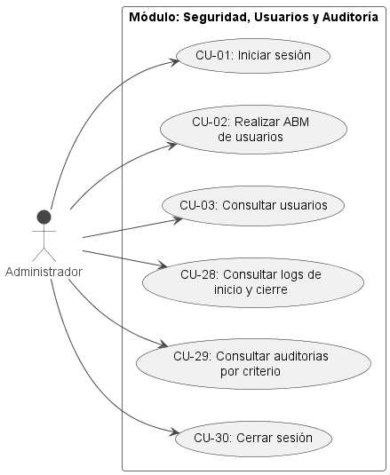
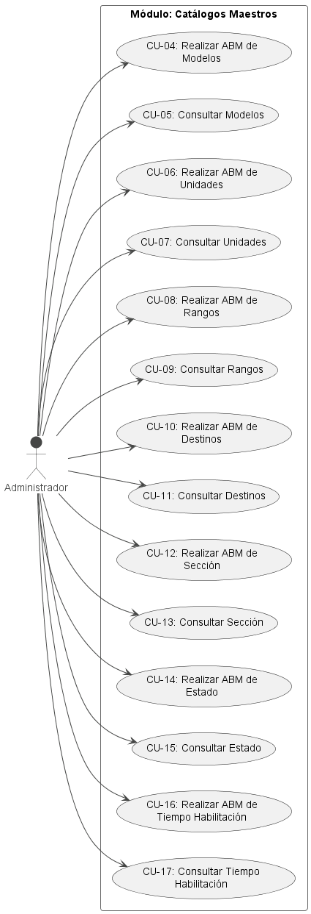
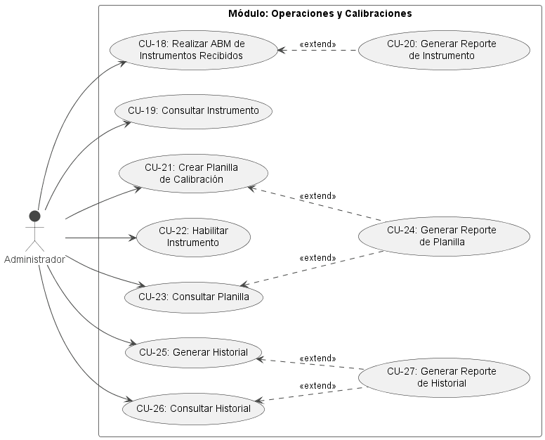
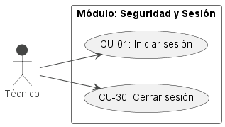
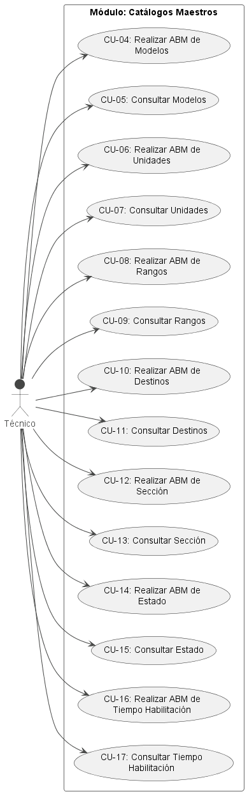
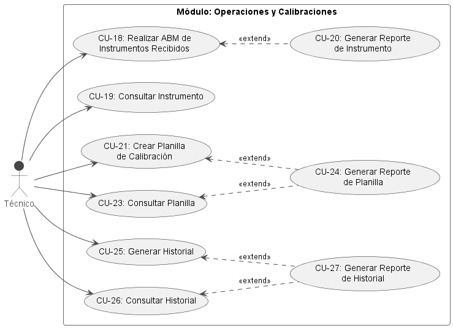
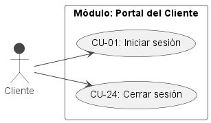

## 🔑 Rol administrador

---

## 🛠️ Rol Técnico

---

## 🧑‍🔧 Rol cliente

---

# Planilla de especificación

## 🔑 Rol Administrador

## Especificación de caso de uso: CU-01

| Campo                               | Descripción                                                                                                                                             |
|:----------------------------------- |:------------------------------------------------------------------------------------------------------------------------------------------------------- |
| **Nombre del Caso de Uso**          | Iniciar sesión                                                                                                                                          |
| **Actor Principal**                 | Administrador                                                                                                                                           |
| **Actores Secundarios**             | -                                                                                                                                                       |
| **Breve descripción**               | El administrador ingresa sus credenciales para ingresar al sistema.                                                                                     |
| **Precondiciones**                  | 1. El usuario debe estar dado de alta en el sistema.                                                                                                    |
| **Flujo Principal**                 | 1. El actor ingresa sus credenciales para entrar al sistema.                                                                                            |
|                                     | 2. El sistema realiza el registro de inicio de sessión. Ejecuta la funcionalidad de registrar el inicio de sesión con los datos requeridos. (*Sistema*) |
|                                     | 3. El actor es rediregido a la pantalla por defecto.                                                                                                    |
|                                     |                                                                                                                                                         |
| **Flujos Alternativos/Excepciones** | -                                                                                                                                                       |
| **Postcondiciones**                 | La redirección a la pantalla default se realiza y queda registrado el inicio de sesión.                                                                 |

## Especificación de caso de uso: CU-02

| Campo                               | Descripción                                                                                                                       |
| ----------------------------------- | --------------------------------------------------------------------------------------------------------------------------------- |
| **Nombre del Caso de Uso**          | Realizar ABM de usuarios                                                                                                          |
| **Actor Principal**                 | Administrador                                                                                                                     |
| **Actores Secundarios**             | -                                                                                                                                 |
| **Breve descripción**               | El Administrador puede realizar las acciones: dar de alta, modificar y/o baja de los tipos de usuarios que utilizaran el sistema. |
| **Precondiciones**                  | 1. Rol Administrador activo.                                                                                                      |
| **Flujo Principal**                 | 1. El actor ingresa los datos correspondientes al usuario a registrar.                                                            |
|                                     | 2. El actor guarda los cambios.                                                                                                   |
| **Flujos Alternativos/Excepciones** | 2a. El actor puede cancelar.                                                                                                      |
| **Postcondiciones**                 | Queda realizada la acción ABM.                                                                                                    |

## Especificación de caso de uso: CU-03

| Campo                               | Descripción                                                                                           |
| ----------------------------------- | ----------------------------------------------------------------------------------------------------- |
| **Nombre del Caso de Uso**          | Consultar usuarios                                                                                    |
| **Actor Principal**                 | Administrador                                                                                         |
| **Actores Secundarios**             | -                                                                                                     |
| **Breve descripción**               | El Administrador puede consultar realizando filtros por criterio de usuarios que utilizan el sistema. |
| **Precondiciones**                  | 1. El usuario, a consultar, debe estar dado de alta.(*CU-02*)                                         |
| **Flujo Principal**                 | 1. El actor selecta las opciones para configurar el filtro.                                           |
|                                     | 2. El actor ejecuta la consulta.                                                                      |
| **Flujos Alternativos/Excepciones** | -                                                                                                     |
| **Postcondiciones**                 | La consulta queda realizada y se muestra el resultado.                                                |

## Especificación de caso de uso: CU-04

| Campo                               | Descripción                                                                                                                                |
| ----------------------------------- | ------------------------------------------------------------------------------------------------------------------------------------------ |
| **Nombre del Caso de Uso**          | Realizar ABM de modelos de instrumento                                                                                                     |
| **Actor Principal**                 | Administrador                                                                                                                              |
| **Actores Secundarios**             | -                                                                                                                                          |
| **Breve descripción**               | El Administrador puede realizar las acciones: dar de alta, modificar y/o baja de los modelos de instrumentos que se utilizarán el sistema. |
| **Precondiciones**                  | 1. Rol Administrador activo.                                                                                                               |
| **Flujo Principal**                 | 1. El actor ingresa los datos correspondientes a los modelos de instrumento a registrar.                                                   |
|                                     | 2. El actor guarda los cambios.                                                                                                            |
| **Flujos Alternativos/Excepciones** | 2a. El actor puede cancelar.                                                                                                               |
| **Postcondiciones**                 | Queda realizada la acción ABM.                                                                                                             |

## Especificación de caso de uso: CU-05

| Campo                               | Descripción                                                                                                               |
| ----------------------------------- | ------------------------------------------------------------------------------------------------------------------------- |
| **Nombre del Caso de Uso**          | Consultar modelos de instrumento                                                                                          |
| **Actor Principal**                 | Administrador                                                                                                             |
| **Actores Secundarios**             | -                                                                                                                         |
| **Breve descripción**               | El Administrador puede consultar realizando filtros por criterio de los modelos de instrumento que se utilizan el sitema. |
| **Precondiciones**                  | 1. El modelo de instrumento, a consultar, debe estar dado de alta. (*CU-04*)                                              |
| **Flujo Principal**                 | 1. El actor selecta las opciones para configurar el filtro.                                                               |
|                                     | 2. El actor ejecuta la consulta.                                                                                          |
| **Flujos Alternativos/Excepciones** | -                                                                                                                         |
| **Postcondiciones**                 | La consulta queda realizada y se muestra el resultado.                                                                    |

## Especificación de caso de uso: CU-06

| Campo                               | Descripción                                                                                                                           |
| ----------------------------------- | ------------------------------------------------------------------------------------------------------------------------------------- |
| **Nombre del Caso de Uso**          | Realizar ABM de unidades de medida                                                                                                    |
| **Actor Principal**                 | Administrador                                                                                                                         |
| **Actores Secundarios**             | -                                                                                                                                     |
| **Breve descripción**               | El Administrador puede realizar las acciones: dar de alta, modificar y/o baja de las unidades de medida que se utilizarán el sistema. |
| **Precondiciones**                  | 1. Rol Administrador activo.                                                                                                          |
| **Flujo Principal**                 | 1. El actor ingresa los datos correspondientes a la unidad de medida a registrar.                                                     |
|                                     | 2. El actor guarda los cambios.                                                                                                       |
| **Flujos Alternativos/Excepciones** | 2a. El actor puede cancelar.                                                                                                          |
| **Postcondiciones**                 | Queda realizada la acción ABM.                                                                                                        |

## Especificación de caso de uso: CU-07

| Campo                               | Descripción                                                                                                        |
| ----------------------------------- | ------------------------------------------------------------------------------------------------------------------ |
| **Nombre del Caso de Uso**          | Consultar unidades de medidas                                                                                      |
| **Actor Principal**                 | Administrador                                                                                                      |
| **Actores Secundarios**             | -                                                                                                                  |
| **Breve descripción**               | El Administrador puede consultar realizando filtros por criterio de unidades de medidas que se utilizan el sitema. |
| **Precondiciones**                  | 1. La unidad de medida, a filtrar, debe estar dada de alta. (*CU-06*)                                              |
| **Flujo Principal**                 | 1. El actor selecta las opciones para configurar el filtro.                                                        |
|                                     | 2. El actor ejecuta la consulta.                                                                                   |
| **Flujos Alternativos/Excepciones** | -                                                                                                                  |
| **Postcondiciones**                 | La consulta queda realizada y se muestra el resultado.                                                             |

## Especificación de caso de uso: CU-08

| Campo                               | Descripción                                                                                                                              |
| ----------------------------------- | ---------------------------------------------------------------------------------------------------------------------------------------- |
| **Nombre del Caso de Uso**          | Realizar ABM  de rangos de medición                                                                                                      |
| **Actor Principal**                 | Administrador                                                                                                                            |
| **Actores Secundarios**             | -                                                                                                                                        |
| **Breve descripción**               | El Administrador puede realizar las acciones: dar de alta, modificar y/o baja de los rangos de medición que se utilizarán en el sistema. |
| **Precondiciones**                  | 1. Rol Administrador activo.                                                                                                             |
| **Flujo Principal**                 | 1. El actor ingresa los datos correspondientes al rango de medición a registrar.                                                         |
|                                     | 2. El actor guarda los cambios.                                                                                                          |
| **Flujos Alternativos/Excepciones** | 2a. El actor puede cancelar.                                                                                                             |
| **Postcondiciones**                 | Queda realizada la acción ABM.                                                                                                           |

## Especificación de caso de uso: CU-09

| Campo                               | Descripción                                                                                                           |
| ----------------------------------- | --------------------------------------------------------------------------------------------------------------------- |
| **Nombre del Caso de Uso**          | Consultar rangos de medición                                                                                          |
| **Actor Principal**                 | Administrador                                                                                                         |
| **Actores Secundarios**             | -                                                                                                                     |
| **Breve descripción**               | El Administrador puede consultar realizando filtros por criterio de rangos de medición que se utilizan en el sistema. |
| **Precondiciones**                  | 1. El rango de medición, a filtrar, debe estar dado de alta. (*CU-08*)                                                |
| **Flujo Principal**                 | 1. El actor selecta las opciones para configurar el filtro.                                                           |
|                                     | 2. El actor ejecuta la consulta.                                                                                      |
| **Flujos Alternativos/Excepciones** | -                                                                                                                     |
| **Postcondiciones**                 | La consulta queda realizada y se muestra el resultado.                                                                |

## Especificación de caso de uso: CU-10

| Campo                               | Descripción                                                                                                                    |
| ----------------------------------- | ------------------------------------------------------------------------------------------------------------------------------ |
| **Nombre del Caso de Uso**          | Realizar ABM de destinos                                                                                                       |
| **Actor Principal**                 | Administrador                                                                                                                  |
| **Actores Secundarios**             | -                                                                                                                              |
| **Breve descripción**               | El Administrador puede realizar las acciones: dar de alta, modificar y/o baja de los destinos que se utilizarán en el sistema. |
| **Precondiciones**                  | 1. Rol Administrador activo.                                                                                                   |
| **Flujo Principal**                 | 1. El actor ingresa los datos correspondientes al destino a registrar.                                                         |
|                                     | 2. El actor guarda los cambios.                                                                                                |
| **Flujos Alternativos/Excepciones** | 2a. El actor puede cancelar.                                                                                                   |
| **Postcondiciones**                 | Queda realizada la acción ABM.                                                                                                 |

## Especificación de caso de uso: CU-11

| Campo                               | Descripción                                                                                                 |
| ----------------------------------- | ----------------------------------------------------------------------------------------------------------- |
| **Nombre del Caso de Uso**          | Consultar destino                                                                                           |
| **Actor Principal**                 | Administrador                                                                                               |
| **Actores Secundarios**             | -                                                                                                           |
| **Breve descripción**               | El Administrador puede consultar realizando filtros por criterio de destinos que se utilizan en el sistema. |
| **Precondiciones**                  | 1. El destino, a filtrar, debe estar dado de alta. (*CU-10*)                                                |
| **Flujo Principal**                 | 1. El actor selecta las opciones para configurar el filtro.                                                 |
|                                     | 2. El actor ejecuta la consulta.                                                                            |
| **Flujos Alternativos/Excepciones** | -                                                                                                           |
| **Postcondiciones**                 | La consulta queda realizada y se muestra el resultado.                                                      |

## Especificación de caso de uso: CU-12

| Campo                               | Descripción                                                                                                                     |
| ----------------------------------- | ------------------------------------------------------------------------------------------------------------------------------- |
| **Nombre del Caso de Uso**          | Realizar ABM de sección                                                                                                         |
| **Actor Principal**                 | Administrador                                                                                                                   |
| **Actores Secundarios**             | -                                                                                                                               |
| **Breve descripción**               | El Administrador puede realizar las acciones: dar de alta, modificar y/o baja de las secciones que se utilizarán en el sistema. |
| **Precondiciones**                  | 1. Rol Administrador activo.                                                                                                    |
| **Flujo Principal**                 | 1. El actor ingresa los datos correspondientes al la sección a registrar.                                                       |
|                                     | 2. El actor guarda los cambios.                                                                                                 |
| **Flujos Alternativos/Excepciones** | 2a. El actor puede cancelar.                                                                                                    |
| **Postcondiciones**                 | Queda realizada la acción ABM.                                                                                                  |

## Especificación de caso de uso: CU-13

| Campo                               | Descripción                                                                                                      |
| ----------------------------------- | ---------------------------------------------------------------------------------------------------------------- |
| **Nombre del Caso de Uso**          | Consultar sección                                                                                                |
| **Actor Principal**                 | Administrador                                                                                                    |
| **Actores Secundarios**             | -                                                                                                                |
| **Breve descripción**               | El Administrador puede consultar realizando filtros por criterio de las secciones que se utilizan en el sistema. |
| **Precondiciones**                  | 1. La sección, a filtrar, debe estar dado de alta. (*CU-12*)                                                     |
| **Flujo Principal**                 | 1. El actor selecta las opciones para configurar el filtro.                                                      |
|                                     | 2. El actor ejecuta la consulta.                                                                                 |
| **Flujos Alternativos/Excepciones** | -                                                                                                                |
| **Postcondiciones**                 | La consulta queda realizada y se muestra el resultado.                                                           |

## Especificación de caso de uso: CU-14

| Campo                               | Descripción                                                                                                                   |
| ----------------------------------- | ----------------------------------------------------------------------------------------------------------------------------- |
| **Nombre del Caso de Uso**          | Realizar ABM de estado                                                                                                        |
| **Actor Principal**                 | Administrador                                                                                                                 |
| **Actores Secundarios**             | -                                                                                                                             |
| **Breve descripción**               | El Administrador puede realizar las acciones: dar de alta, modificar y/o baja de los estados que se utilizarán en el sistema. |
| **Precondiciones**                  | 1. Rol Administrador activo.                                                                                                  |
| **Flujo Principal**                 | 1. El actor ingresa los datos correspondientes al estado a registrar.                                                         |
|                                     | 2. El actor guarda los cambios.                                                                                               |
| **Flujos Alternativos/Excepciones** | 2a. El actor puede cancelar.                                                                                                  |
| **Postcondiciones**                 | Queda realizada la acción ABM.                                                                                                |

## Especificación de caso de uso: CU-15

| Campo                               | Descripción                                                                                                    |
| ----------------------------------- | -------------------------------------------------------------------------------------------------------------- |
| **Nombre del Caso de Uso**          | Consultar estado                                                                                               |
| **Actor Principal**                 | Administrador                                                                                                  |
| **Actores Secundarios**             | -                                                                                                              |
| **Breve descripción**               | El Administrador puede consultar realizando filtros por criterio de los estados que se utilizan en el sistema. |
| **Precondiciones**                  | 1. El estado, a filtrar, debe estar dado de alta. (*CU-14*)                                                    |
| **Flujo Principal**                 | 1. El actor selecta las opciones para configurar el filtro.                                                    |
|                                     | 2. El actor ejecuta la consulta.                                                                               |
| **Flujos Alternativos/Excepciones** | -                                                                                                              |
| **Postcondiciones**                 | La consulta queda realizada y se muestra el resultado.                                                         |

## Especificación de caso de uso: CU-16

| Campo                               | Descripción                                                                                                                                   |
| ----------------------------------- | --------------------------------------------------------------------------------------------------------------------------------------------- |
| **Nombre del Caso de Uso**          | Realizar ABM de tiempo de habilitación                                                                                                        |
| **Actor Principal**                 | Administrador                                                                                                                                 |
| **Actores Secundarios**             | -                                                                                                                                             |
| **Breve descripción**               | El Administrador puede realizar las acciones: dar de alta, modificar y/o baja de los tiempos de habilitación que se utilizarán en el sistema. |
| **Precondiciones**                  | 1. Rol Administrador activo.                                                                                                                  |
| **Flujo Principal**                 | 1. El actor ingresa los datos correspondientes al los timepos de habilitación a registrar.                                                    |
|                                     | 2. El actor guarda los cambios.                                                                                                               |
| **Flujos Alternativos/Excepciones** | 2a. El actor puede cancelar.                                                                                                                  |
| **Postcondiciones**                 | Queda realizada la acción ABM.                                                                                                                |

## Especificación de caso de uso: CU-17

| Campo                               | Descripción                                                                                                                    |
| ----------------------------------- | ------------------------------------------------------------------------------------------------------------------------------ |
| **Nombre del Caso de Uso**          | Consultar tiempo de habilitación                                                                                               |
| **Actor Principal**                 | Administrador                                                                                                                  |
| **Actores Secundarios**             | -                                                                                                                              |
| **Breve descripción**               | El Administrador puede consultar realizando filtros por criterio de los timepos de habilitación que se utilizan en el sistema. |
| **Precondiciones**                  | 1. El tiempo de habilitación, a filtrar, debe estar dado de alta. (*CU-16*)                                                    |
| **Flujo Principal**                 | 1. El actor selecta las opciones para configurar el filtro.                                                                    |
|                                     | 2. El actor ejecuta la consulta.                                                                                               |
| **Flujos Alternativos/Excepciones** | -                                                                                                                              |
| **Postcondiciones**                 | La consulta queda realizada y se muestra el resultado.                                                                         |

## Especificación de caso de uso: CU-18

| Campo                               | Descripción                                                                                                                                             |
| ----------------------------------- | ------------------------------------------------------------------------------------------------------------------------------------------------------- |
| **Nombre del Caso de Uso**          | Realizar ABM de instrumentos recibidos                                                                                                                  |
| **Actor Principal**                 | Administrador                                                                                                                                           |
| **Actores Secundarios**             | -                                                                                                                                                       |
| **Breve descripción**               | El Administrador puede realizar las acciones: dar de alta, modificar y/o baja de los instrumentos que se procesarán en el sistema para su trazabilidad. |
| **Precondiciones**                  | 1. Rol Administrador activo.                                                                                                                            |
|                                     | 2. El modelo de instrumento debe estar dado de alta en el sistema. (*CU-04*)                                                                            |
| **Flujo Principal**                 | 1. El actor ingresa los datos correspondientes al instrumento a registrar.                                                                              |
|                                     | 2. El actor guarda los cambios.                                                                                                                         |
| **Flujos Alternativos/Excepciones** | 2a. El actor puede cancelar.                                                                                                                            |
| **Postcondiciones**                 | Queda realizada la acción ABM.                                                                                                                          |

## Especificación de caso de uso: CU-19

| Campo                               | Descripción                                                                                                     |
| ----------------------------------- | --------------------------------------------------------------------------------------------------------------- |
| **Nombre del Caso de Uso**          | Consultar instrumento recibido                                                                                  |
| **Actor Principal**                 | Administrador                                                                                                   |
| **Actores Secundarios**             | -                                                                                                               |
| **Precondiciones**                  | 1. El instrumento recibido, a filtrar, debe estar dado de alta. (*CU-18*)                                       |
| **Breve descripción**               | El Administrador puede consultar realizando filtros por criterio de instrumentos que se utilizan en el sistema. |
| **Flujo Principal**                 | 1. El actor selecta las opciones para configurar el filtro.                                                     |
|                                     | 2. El actor ejecuta la consulta.                                                                                |
| **Flujos Alternativos/Excepciones** | -                                                                                                               |
| **Postcondiciones**                 | La consulta queda realizada y se muestra el resultado.                                                          |

## Especificación de caso de uso: CU-20 (*extend de CU-18*)

| Campo                               | Descripción                                                                       |
| ----------------------------------- | --------------------------------------------------------------------------------- |
| **Nombre del Caso de Uso**          | Generar reporte de instrumento recibido                                           |
| **Actor Principal**                 | Administrador                                                                     |
| **Actores Secundarios**             | -                                                                                 |
| **Breve descripción**               | El administrador tiene la opción de realizar un reporte del instrumento recibido. |
| **Precondiciones**                  | 1. El instrumento recibido debe estar dado de alta. (*CU-18*)                     |
| **Flujo Principal**                 | 1. El actor selecciona la opción de "Generar reporte"                             |
| **Flujos Alternativos/Excepciones** | -                                                                                 |
| **Postcondiciones**                 | El reporte queda generado.                                                        |

## Especificación de caso de uso: CU-21

| Campo                               | Descripción                                                                                                                 |
| ----------------------------------- | --------------------------------------------------------------------------------------------------------------------------- |
| **Nombre del Caso de Uso**          | Crear planilla de calibración                                                                                               |
| **Actor Principal**                 | Administrador                                                                                                               |
| **Actores Secundarios**             | -                                                                                                                           |
| **Precondiciones**                  | El instrumento recibido debe estar ingresado en el sistema. (*CU-18*)                                                       |
| **Breve descripción**               | El Administrador crea la planilla de calibración con los datos correspondientes a la medición.                              |
| **Flujo Principal**                 | 1. El actor selecciona el instrumento a medir con sus campos requeridos.                                                    |
|                                     | 2. El actor completa los datos de medición.                                                                                 |
|                                     | 3. El actor completa los datos de los responsables.                                                                         |
|                                     | 4. El actor selecta habilitación.                                                                                           |
|                                     | 5. El actor completa dato de vencimiento.                                                                                   |
|                                     | 6. El actor ejecuta la generación de la planilla de calibración.                                                            |
| **Flujos Alternativos/Excepciones** | 4a. El actor selecta inhabilitación.                                                                                        |
|                                     | 5a. El sistema no valida dato de vencimiento.                                                                               |
|                                     | 6a. El actor ejecuta la generación de la planilla de calibración.                                                           |
|                                     | 7. `extend`: *Generar reporte planilla de calibración*: es posible generar un reporte de planilla de calibración. (*CU-24*) |
| **Postcondiciones**                 | Queda generada la planilla de calibración.                                                                                  |

## Especificación de caso de uso: CU-22

| Campo                               | Descripción                                                                                |
| ----------------------------------- | ------------------------------------------------------------------------------------------ |
| **Nombre del Caso de Uso**          | Habilitar instrumento recibido.                                                            |
| **Actor Principal**                 | Administrador                                                                              |
| **Actores Secundarios**             | -                                                                                          |
| **Precondiciones**                  | 1. El modelo de instrumento debe estar dado de alta en el sistema. (*CU-04*)               |
|                                     | 2. El instrumento recibido debe estar ingresado en el sistema.(*CU-18*)                    |
| **Breve descripción**               | El Administrador puede realizar la acción: habilitar/no habilitar el instrumento recibido. |
| **Flujo Principal**                 | 1. El actor selecciona la opción correspondiente para habilitar el instrumento recibido.   |
|                                     | 2. El actor guarda los cambios.                                                            |
| **Flujos Alternativos/Excepciones** | 2a. El actor puede cancelar.                                                               |
| **Postcondiciones**                 | Queda realizada la acción de habilitar/no habilitar al instrumento recibido.               |

## Especificación de caso de uso: CU-23

| Campo                               | Descripción                                                                                                                |
| ----------------------------------- | -------------------------------------------------------------------------------------------------------------------------- |
| **Nombre del Caso de Uso**          | Consultar planilla de calibración                                                                                          |
| **Actor Principal**                 | Administrador                                                                                                              |
| **Actores Secundarios**             | -                                                                                                                          |
| **Precondiciones**                  | 1. Planilla de calibración debe estar creada. (*CU-21*)                                                                    |
| **Breve descripción**               | El Administrador realiza una consulta para ubicar la planilla desada.                                                      |
| **Flujo Principal**                 | 1. El actor selecciona la opción de "Buscar planilla".                                                                     |
|                                     | 2. El actor ingresa el dato requerido para la búsqueda.                                                                    |
|                                     | 3. El actor ejecuta la búsqueda.                                                                                           |
| **Flujos Alternativos/Excepciones** | 4. `extend`: *Generar reporte planilla de calibración:* es posible generar un reporte de planilla de clibración. (*CU-24*) |
| **Postcondiciones**                 | La búqueda queda realizada y se muestra la planilla de calibración.                                                        |

## Especificación de caso de uso: CU-24 (*extend de CU-21 o CU-23*)

| Campo                               | Descripción                                                                            |
| ----------------------------------- | -------------------------------------------------------------------------------------- |
| **Nombre del Caso de Uso**          | Generar reporte planilla de calibración                                                |
| **Actor Principal**                 | Administrador                                                                          |
| **Actores Secundarios**             | -                                                                                      |
| **Breve descripción**               | El administrador tiene la opción de realizar un reporte de la planilla de calibración. |
| **Precondiciones**                  | 1. La planillla de calibración debe estar generada.(*CU-21*)                           |
| **Flujo Principal**                 | 1. El actor selecciona la opción de "Generar reporte".                                 |
| **Flujos Alternativos/Excepciones** | 1a. O, la consulta de planilla de calibración debe estar generada. (*CU-23*)           |
| **Postcondiciones**                 | El reporte queda generado.                                                             |

## Especificación de caso de uso: CU-25

| Campo                               | Descripción                                                                                                                    |
| ----------------------------------- | ------------------------------------------------------------------------------------------------------------------------------ |
| **Nombre del Caso de Uso**          | Generar historial                                                                                                              |
| **Actor Principal**                 | Administrador                                                                                                                  |
| **Actores Secundarios**             | -                                                                                                                              |
| **Breve descripción**               | El Administrador realiza la generación del historial.                                                                          |
| **Precondiciones**                  | 1. Debe estar creada la planilla de calibración. (*CU-24*)                                                                     |
|                                     | 2. El instrumento debe tener asignado un valor de habilitación. Ya sea habilitado/no habilitado. (*CU-22*)                     |
| **Flujo Principal**                 | 1. El actor preciona el botón para generar el historial.                                                                       |
| **Flujos Alternativos/Excepciones** | 1. `extend`: *Generar reporte historial de instrumento*: es posible generar un reporte del historial de instrumento. (*CU-27*) |
| **Postcondiciones**                 | El historial queda realizado y su registro.                                                                                    |

## Especificación de caso de uso: CU-26

| Campo                               | Descripción                                                                                                                  |
| ----------------------------------- | ---------------------------------------------------------------------------------------------------------------------------- |
| **Nombre del Caso de Uso**          | Consultar historial                                                                                                          |
| **Actor Principal**                 | Administrador                                                                                                                |
| **Actores Secundarios**             | -                                                                                                                            |
| **Precondiciones**                  | 1. El historial debe estar creado. (*CU-25*)                                                                                 |
| **Breve descripción**               | El Administrador realiza una consulta para ubicar el historial deseada.                                                      |
| **Flujo Principal**                 | 1. El actor selecciona la opción de "Buscar historial".                                                                      |
|                                     | 2. El actor ingresa el dato requerido para la búsqueda.                                                                      |
|                                     | 3. El actor ejecuta la búsqueda.                                                                                             |
| **Flujos Alternativos/Excepciones** | 1. `extend`: *Generar reporte historial de instrumento*: es posible generar un reporte de planilla de calibración. (*CU-27*) |
| **Postcondiciones**                 | La búqueda queda realizada y se muestra el historial.                                                                        |

## Especificación de caso de uso: CU-27 (*extend de CU-25 y CU-26*)

| Campo                               | Descripción                                                                       |
| ----------------------------------- | --------------------------------------------------------------------------------- |
| **Nombre del Caso de Uso**          | Generar reporte historial de instrumento                                          |
| **Actor Principal**                 | Administrador                                                                     |
| **Actores Secundarios**             | -                                                                                 |
| **Breve descripción**               | El administrador tiene lo opción de realizar un reporte del instrumento recibido. |
| **Precondiciones**                  | 1.Generar historial debe realizarse primero. (*CU-19*)                            |
| **Flujo Principal**                 | 1. El actor selecciona la opción de "Generar reporte".                            |
| **Flujos Alternativos/Excepciones** | -                                                                                 |
| **Postcondiciones**                 | El reporte queda generado.                                                        |

## Especificación de caso de uso: CU-28

| Campo                               | Descripción                                                         |
| ----------------------------------- | ------------------------------------------------------------------- |
| **Nombre del Caso de Uso**          | Consultar logs de inicio y cierre de sesión                         |
| **Actor Principal**                 | Administrador                                                       |
| **Actores Secundarios**             | -                                                                   |
| **Breve descripción**               | El Administrador consulta los logs de inicio de sesión al sistema.  |
| **Precondiciones**                  | 1. Rol Administrador activo.                                        |
| **Flujo Principal**                 | 1. El actor selecta la opción de "ver logs".                        |
|                                     | 2. El actor selecta las opciones para configurar el filtro.         |
|                                     | 4. El actor ejecuta la consulta.                                    |
| **Flujos Alternativos/Excepciones** | -                                                                   |
| **Postcondiciones**                 | 1.Se genera y muestra el listado de logs, con su respectivo filtro. |

## Especificación de caso de uso: CU-29

| Campo                               | Descripción                                                                                                                                                          |
| ----------------------------------- | -------------------------------------------------------------------------------------------------------------------------------------------------------------------- |
| **Nombre del Caso de Uso**          | Consultar auditorias por criterio                                                                                                                                    |
| **Actor Principal**                 | Administrador                                                                                                                                                        |
| **Actores Secundarios**             | -                                                                                                                                                                    |
| **Breve descripción**               | El Administrador hace consulta de auditorías, como habilitaciones, cantidad de intrumentos fuera de servicio, elementos por destino que se realizaron en el sistema. |
| **Precondiciones**                  | 1. Rol Administrador activo.                                                                                                                                         |
| **Flujo Principal**                 | 1. El actor selecta la opción de "Auditorias".                                                                                                                       |
|                                     | 2. El actor selecta las opciones para configurar el filtro.                                                                                                          |
|                                     | 3. El actor ejecuta la consulta.                                                                                                                                     |
| **Flujos Alternativos/Excepciones** | -                                                                                                                                                                    |
| **Postcondiciones**                 | 1. Se genera y muestra el listado de resultados, con su respectivo filtro.                                                                                           |

## Especificación de caso de uso: CU-30

| Campo                               | Descripción                                                                                                                                             |
|:----------------------------------- |:------------------------------------------------------------------------------------------------------------------------------------------------------- |
| **Nombre del Caso de Uso**          | Cerrar sesión                                                                                                                                           |
| **Actor Principal**                 | Administrador                                                                                                                                           |
| **Actores Secundarios**             | -                                                                                                                                                       |
| **Breve descripción**               | El administrador selecciona la opción de cerrar sesión.                                                                                                 |
| **Precondiciones**                  | 1. El usuario debe estar dado de alta en el sistema. (*CU-02*)                                                                                          |
| **Flujo Principal**                 | 1. El actor ejecuta la funcionalidad de cerrar sesión.                                                                                                  |
|                                     | 2. El sistema realiza el registro de cierre de sessión. Ejecuta la funcionalidad de registrar el cierre de sesión con los datos requeridos. (*Sistema*) |
|                                     | 3. El actor es rediregido a la pantalla de login.                                                                                                       |
| **Flujos Alternativos/Excepciones** | -                                                                                                                                                       |
| **Postcondiciones**                 | La redirección a la pantalla login se realiza y queda registrado el cierre de sesión.                                                                   |

---

## 🛠️ Rol Técnico

## Especificación de caso de uso: CU-01

| Campo                               | Descripción                                                                                                                                             |
|:----------------------------------- |:------------------------------------------------------------------------------------------------------------------------------------------------------- |
| **Nombre del Caso de Uso**          | Iniciar sesión                                                                                                                                          |
| **Actor Principal**                 | Técnico                                                                                                                                                 |
| **Actores Secundarios**             | -                                                                                                                                                       |
| **Breve descripción**               | El técnico ingresa sus credenciales para ingresar al sistema.                                                                                           |
| **Precondiciones**                  | 1. El usuario debe estar dado de alta en el sistema.                                                                                                    |
| **Flujo Principal**                 | 1. El actor ingresa sus credenciales para entrar al sistema.                                                                                            |
|                                     | 2. El sistema realiza el registro de inicio de sessión. Ejecuta la funcionalidad de registrar el inicio de sesión con los datos requeridos. (*Sistema*) |
|                                     | 3. El actor es redirigido a la pantalla por defecto.                                                                                                    |
|                                     |                                                                                                                                                         |
| **Flujos Alternativos/Excepciones** | -                                                                                                                                                       |
| **Postcondiciones**                 | La redirección a la pantalla default se realiza y queda registrado el inicio de sesión.                                                                 |

## Especificación de caso de uso: CU-04

| Campo                               | Descripción                                                                                                                          |
| ----------------------------------- | ------------------------------------------------------------------------------------------------------------------------------------ |
| **Nombre del Caso de Uso**          | Realizar ABM de modelos de instrumento                                                                                               |
| **Actor Principal**                 | Técnico                                                                                                                              |
| **Actores Secundarios**             | -                                                                                                                                    |
| **Breve descripción**               | El técnico puede realizar las acciones: dar de alta, modificar y/o baja de los modelos de instrumentos que se utilizarán el sistema. |
| **Precondiciones**                  | 1. Rol Técnico activo.                                                                                                               |
| **Flujo Principal**                 | 1. El actor ingresa los datos correspondientes a los modelos de instrumento a registrar.                                             |
|                                     | 2. El actor guarda los cambios.                                                                                                      |
| **Flujos Alternativos/Excepciones** | 2a. El actor puede cancelar.                                                                                                         |
| **Postcondiciones**                 | Queda realizada la acción ABM.                                                                                                       |

## Especificación de caso de uso: CU-05

| Campo                               | Descripción                                                                                                         |
| ----------------------------------- | ------------------------------------------------------------------------------------------------------------------- |
| **Nombre del Caso de Uso**          | Consultar modelos de instrumento                                                                                    |
| **Actor Principal**                 | Técnico                                                                                                             |
| **Actores Secundarios**             | -                                                                                                                   |
| **Breve descripción**               | El técnico puede consultar realizando filtros por criterio de los modelos de instrumento que se utilizan el sitema. |
| **Precondiciones**                  | 1. El modelo de instrumento, a consultar, debe estar dado de alta. (*CU-04*)                                        |
| **Flujo Principal**                 | 1. El actor selecta las opciones para configurar el filtro.                                                         |
|                                     | 2. El actor ejecuta la consulta.                                                                                    |
| **Flujos Alternativos/Excepciones** | -                                                                                                                   |
| **Postcondiciones**                 | La consulta queda realizada y se muestra el resultado.                                                              |

## Especificación de caso de uso: CU-06

| Campo                               | Descripción                                                                                                                     |
| ----------------------------------- | ------------------------------------------------------------------------------------------------------------------------------- |
| **Nombre del Caso de Uso**          | Realizar ABM de unidades de medida                                                                                              |
| **Actor Principal**                 | Técnico                                                                                                                         |
| **Actores Secundarios**             | -                                                                                                                               |
| **Breve descripción**               | El técnico puede realizar las acciones: dar de alta, modificar y/o baja de las unidades de medida que se utilizarán el sistema. |
| **Precondiciones**                  | 1. Rol Técnico activo.                                                                                                          |
| **Flujo Principal**                 | 1. El actor ingresa los datos correspondientes a la unidad de medida a registrar.                                               |
|                                     | 2. El actor guarda los cambios.                                                                                                 |
| **Flujos Alternativos/Excepciones** | 2a. El actor puede cancelar.                                                                                                    |
| **Postcondiciones**                 | Queda realizada la acción ABM.                                                                                                  |

## Especificación de caso de uso: CU-07

| Campo                               | Descripción                                                                                                  |
| ----------------------------------- | ------------------------------------------------------------------------------------------------------------ |
| **Nombre del Caso de Uso**          | Consultar unidades de medidas                                                                                |
| **Actor Principal**                 | Técnico                                                                                                      |
| **Actores Secundarios**             | -                                                                                                            |
| **Breve descripción**               | El técnico puede consultar realizando filtros por criterio de unidades de medidas que se utilizan el sitema. |
| **Precondiciones**                  | 1. La unidad de medida, a filtrar, debe estar dada de alta. (*CU-06*)                                        |
| **Flujo Principal**                 | 1. El actor selecta las opciones para configurar el filtro.                                                  |
|                                     | 2. El actor ejecuta la consulta.                                                                             |
| **Flujos Alternativos/Excepciones** | -                                                                                                            |
| **Postcondiciones**                 | La consulta queda realizada y se muestra el resultado.                                                       |

## Especificación de caso de uso: CU-08

| Campo                               | Descripción                                                                                                                        |
| ----------------------------------- | ---------------------------------------------------------------------------------------------------------------------------------- |
| **Nombre del Caso de Uso**          | Realizar ABM  de rangos de medición                                                                                                |
| **Actor Principal**                 | Técnico                                                                                                                            |
| **Actores Secundarios**             | -                                                                                                                                  |
| **Breve descripción**               | El técnico puede realizar las acciones: dar de alta, modificar y/o baja de los rangos de medición que se utilizarán en el sistema. |
| **Precondiciones**                  | 1. Rol Técnico activo.                                                                                                             |
| **Flujo Principal**                 | 1. El actor ingresa los datos correspondientes al rango de medición a registrar.                                                   |
|                                     | 2. El actor guarda los cambios.                                                                                                    |
| **Flujos Alternativos/Excepciones** | 2a. El actor puede cancelar.                                                                                                       |
| **Postcondiciones**                 | Queda realizada la acción ABM.                                                                                                     |

## Especificación de caso de uso: CU-09

| Campo                               | Descripción                                                                                                     |
| ----------------------------------- | --------------------------------------------------------------------------------------------------------------- |
| **Nombre del Caso de Uso**          | Consultar rangos de medición                                                                                    |
| **Actor Principal**                 | Técnico                                                                                                         |
| **Actores Secundarios**             | -                                                                                                               |
| **Breve descripción**               | El técnico puede consultar realizando filtros por criterio de rangos de medición que se utilizan en el sistema. |
| **Precondiciones**                  | 1. El rango de medición, a filtrar, debe estar dado de alta. (*CU-08*)                                          |
| **Flujo Principal**                 | 1. El actor selecta las opciones para configurar el filtro.                                                     |
|                                     | 2. El actor ejecuta la consulta.                                                                                |
| **Flujos Alternativos/Excepciones** | -                                                                                                               |
| **Postcondiciones**                 | La consulta queda realizada y se muestra el resultado.                                                          |

## Especificación de caso de uso: CU-10

| Campo                               | Descripción                                                                                                              |
| ----------------------------------- | ------------------------------------------------------------------------------------------------------------------------ |
| **Nombre del Caso de Uso**          | Realizar ABM de destinos                                                                                                 |
| **Actor Principal**                 | Técnico                                                                                                                  |
| **Actores Secundarios**             | -                                                                                                                        |
| **Breve descripción**               | El técnico puede realizar las acciones: dar de alta, modificar y/o baja de los destinos que se utilizarán en el sistema. |
| **Precondiciones**                  | 1. Rol Técnico activo.                                                                                                   |
| **Flujo Principal**                 | 1. El actor ingresa los datos correspondientes al destino a registrar.                                                   |
|                                     | 2. El actor guarda los cambios.                                                                                          |
| **Flujos Alternativos/Excepciones** | 2a. El actor puede cancelar.                                                                                             |
| **Postcondiciones**                 | Queda realizada la acción ABM.                                                                                           |

## Especificación de caso de uso: CU-11

| Campo                               | Descripción                                                                                           |
| ----------------------------------- | ----------------------------------------------------------------------------------------------------- |
| **Nombre del Caso de Uso**          | Consultar destino                                                                                     |
| **Actor Principal**                 | Técnico                                                                                               |
| **Actores Secundarios**             | -                                                                                                     |
| **Breve descripción**               | El técnico puede consultar realizando filtros por criterio de destinos que se utilizan en el sistema. |
| **Precondiciones**                  | 1. El destino, a filtrar, debe estar dado de alta. (*CU-10*)                                          |
| **Flujo Principal**                 | 1. El actor selecta las opciones para configurar el filtro.                                           |
|                                     | 2. El actor ejecuta la consulta.                                                                      |
| **Flujos Alternativos/Excepciones** | -                                                                                                     |
| **Postcondiciones**                 | La consulta queda realizada y se muestra el resultado.                                                |

## Especificación de caso de uso: CU-12

| Campo                               | Descripción                                                                                                               |
| ----------------------------------- | ------------------------------------------------------------------------------------------------------------------------- |
| **Nombre del Caso de Uso**          | Realizar ABM de sección                                                                                                   |
| **Actor Principal**                 | Técnico                                                                                                                   |
| **Actores Secundarios**             | -                                                                                                                         |
| **Breve descripción**               | El técnico puede realizar las acciones: dar de alta, modificar y/o baja de las secciones que se utilizarán en el sistema. |
| **Precondiciones**                  | 1. Rol Técnico activo.                                                                                                    |
| **Flujo Principal**                 | 1. El actor ingresa los datos correspondientes al la sección a registrar.                                                 |
|                                     | 2. El actor guarda los cambios.                                                                                           |
| **Flujos Alternativos/Excepciones** | 2a. El actor puede cancelar.                                                                                              |
| **Postcondiciones**                 | Queda realizada la acción ABM.                                                                                            |

## Especificación de caso de uso: CU-13

| Campo                               | Descripción                                                                                                |
| ----------------------------------- | ---------------------------------------------------------------------------------------------------------- |
| **Nombre del Caso de Uso**          | Consultar sección                                                                                          |
| **Actor Principal**                 | Técnico                                                                                                    |
| **Actores Secundarios**             | -                                                                                                          |
| **Breve descripción**               | El técnico puede consultar realizando filtros por criterio de las secciones que se utilizan en el sistema. |
| **Precondiciones**                  | 1. La sección, a filtrar, debe estar dado de alta. (*CU-12*)                                               |
| **Flujo Principal**                 | 1. El actor selecta las opciones para configurar el filtro.                                                |
|                                     | 2. El actor ejecuta la consulta.                                                                           |
| **Flujos Alternativos/Excepciones** | -                                                                                                          |
| **Postcondiciones**                 | La consulta queda realizada y se muestra el resultado.                                                     |

## Especificación de caso de uso: CU-14

| Campo                               | Descripción                                                                                                             |
| ----------------------------------- | ----------------------------------------------------------------------------------------------------------------------- |
| **Nombre del Caso de Uso**          | Realizar ABM de estado                                                                                                  |
| **Actor Principal**                 | Técnico                                                                                                                 |
| **Actores Secundarios**             | -                                                                                                                       |
| **Breve descripción**               | El técnico puede realizar las acciones: dar de alta, modificar y/o baja de los estados que se utilizarán en el sistema. |
| **Precondiciones**                  | 1. Rol Técnico activo.                                                                                                  |
| **Flujo Principal**                 | 1. El actor ingresa los datos correspondientes al estado a registrar.                                                   |
|                                     | 2. El actor guarda los cambios.                                                                                         |
| **Flujos Alternativos/Excepciones** | 2a. El actor puede cancelar.                                                                                            |
| **Postcondiciones**                 | Queda realizada la acción ABM.                                                                                          |

## Especificación de caso de uso: CU-15

| Campo                               | Descripción                                                                                              |
| ----------------------------------- | -------------------------------------------------------------------------------------------------------- |
| **Nombre del Caso de Uso**          | Consultar estado                                                                                         |
| **Actor Principal**                 | Técnico                                                                                                  |
| **Actores Secundarios**             | -                                                                                                        |
| **Breve descripción**               | El técnico puede consultar realizando filtros por criterio de los estados que se utilizan en el sistema. |
| **Precondiciones**                  | 1. El estado, a filtrar, debe estar dado de alta. (*CU-14*)                                              |
| **Flujo Principal**                 | 1. El actor selecta las opciones para configurar el filtro.                                              |
|                                     | 2. El actor ejecuta la consulta.                                                                         |
| **Flujos Alternativos/Excepciones** | -                                                                                                        |
| **Postcondiciones**                 | La consulta queda realizada y se muestra el resultado.                                                   |

## Especificación de caso de uso: CU-16

| Campo                               | Descripción                                                                                                                             |
| ----------------------------------- | --------------------------------------------------------------------------------------------------------------------------------------- |
| **Nombre del Caso de Uso**          | Realizar ABM de tiempo de habilitación                                                                                                  |
| **Actor Principal**                 | Técnico                                                                                                                                 |
| **Actores Secundarios**             | -                                                                                                                                       |
| **Breve descripción**               | El técnico puede realizar las acciones: dar de alta, modificar y/o baja de los tiempos de habilitación que se utilizarán en el sistema. |
| **Precondiciones**                  | 1. Rol Técnico activo.                                                                                                                  |
| **Flujo Principal**                 | 1. El actor ingresa los datos correspondientes al los timepos de habilitación a registrar.                                              |
|                                     | 2. El actor guarda los cambios.                                                                                                         |
| **Flujos Alternativos/Excepciones** | 2a. El actor puede cancelar.                                                                                                            |
| **Postcondiciones**                 | Queda realizada la acción ABM.                                                                                                          |

## Especificación de caso de uso: CU-17

| Campo                               | Descripción                                                                                                              |
| ----------------------------------- | ------------------------------------------------------------------------------------------------------------------------ |
| **Nombre del Caso de Uso**          | Consultar tiempo de habilitación                                                                                         |
| **Actor Principal**                 | Técnico                                                                                                                  |
| **Actores Secundarios**             | -                                                                                                                        |
| **Breve descripción**               | El técnico puede consultar realizando filtros por criterio de los timepos de habilitación que se utilizan en el sistema. |
| **Precondiciones**                  | 1. El tiempo de habilitación, a filtrar, debe estar dado de alta. (*CU-16*)                                              |
| **Flujo Principal**                 | 1. El actor selecta las opciones para configurar el filtro.                                                              |
|                                     | 2. El actor ejecuta la consulta.                                                                                         |
| **Flujos Alternativos/Excepciones** | -                                                                                                                        |
| **Postcondiciones**                 | La consulta queda realizada y se muestra el resultado.                                                                   |

## Especificación de caso de uso: CU-18

| Campo                               | Descripción                                                                                                                                       |
| ----------------------------------- | ------------------------------------------------------------------------------------------------------------------------------------------------- |
| **Nombre del Caso de Uso**          | Realizar ABM de instrumentos recibidos                                                                                                            |
| **Actor Principal**                 | Técnico                                                                                                                                           |
| **Actores Secundarios**             | -                                                                                                                                                 |
| **Breve descripción**               | El técnico puede realizar las acciones: dar de alta, modificar y/o baja de los instrumentos que se procesarán en el sistema para su trazabilidad. |
| **Precondiciones**                  | 1. Rol Técnico activo.                                                                                                                            |
|                                     | 2. El modelo de instrumento debe estar dado de alta en el sistema. (*CU-04*)                                                                      |
| **Flujo Principal**                 | 1. El actor ingresa los datos correspondientes al instrumento a registrar.                                                                        |
|                                     | 2. El actor guarda los cambios.                                                                                                                   |
| **Flujos Alternativos/Excepciones** | 2a. El actor puede cancelar.                                                                                                                      |
| **Postcondiciones**                 | Queda realizada la acción ABM.                                                                                                                    |

## Especificación de caso de uso: CU-19

| Campo                               | Descripción                                                                                               |
| ----------------------------------- | --------------------------------------------------------------------------------------------------------- |
| **Nombre del Caso de Uso**          | Consultar instrumento recibido                                                                            |
| **Actor Principal**                 | Técnico                                                                                                   |
| **Actores Secundarios**             | -                                                                                                         |
| **Precondiciones**                  | 1. El instrumento recibido, a filtrar, debe estar dado de alta. (*CU-18*)                                 |
| **Breve descripción**               | El técnico puede consultar realizando filtros por criterio de instrumentos que se utilizan en el sistema. |
| **Flujo Principal**                 | 1. El actor selecta las opciones para configurar el filtro.                                               |
|                                     | 2. El actor ejecuta la consulta.                                                                          |
| **Flujos Alternativos/Excepciones** | -                                                                                                         |
| **Postcondiciones**                 | La consulta queda realizada y se muestra el resultado.                                                    |

## Especificación de caso de uso: CU-20 (*extend de CU-18*)

| Campo                               | Descripción                                                                 |
| ----------------------------------- | --------------------------------------------------------------------------- |
| **Nombre del Caso de Uso**          | Generar reporte de instrumento recibido                                     |
| **Actor Principal**                 | Técnico                                                                     |
| **Actores Secundarios**             | -                                                                           |
| **Breve descripción**               | El técnico tiene la opción de realizar un reporte del instrumento recibido. |
| **Precondiciones**                  | 1. El instrumento recibido debe estar dado de alta. (*CU-18*)               |
| **Flujo Principal**                 | 1. El actor selecciona la opción de "Generar reporte"                       |
| **Flujos Alternativos/Excepciones** | -                                                                           |
| **Postcondiciones**                 | El reporte queda generado.                                                  |

## Especificación de caso de uso: CU-21

| Campo                               | Descripción                                                                                                                 |
| ----------------------------------- | --------------------------------------------------------------------------------------------------------------------------- |
| **Nombre del Caso de Uso**          | Crear planilla de calibración                                                                                               |
| **Actor Principal**                 | Técnico                                                                                                                     |
| **Actores Secundarios**             | -                                                                                                                           |
| **Precondiciones**                  | El instrumento recibido debe estar ingresado en el sistema. (*CU-18*)                                                       |
| **Breve descripción**               | El técnico crea la planilla de calibración con los datos correspondientes a la medición.                                    |
| **Flujo Principal**                 | 1. El actor selecciona el instrumento a medir con sus campos requeridos.                                                    |
|                                     | 2. El actor completa los datos de medición.                                                                                 |
|                                     | 3. El actor completa los datos de los responsables.                                                                         |
|                                     | 4. El actor selecta habilitación.                                                                                           |
|                                     | 5. El actor completa dato de vencimiento.                                                                                   |
|                                     | 6. El actor ejecuta la generación de la planilla de calibración.                                                            |
| **Flujos Alternativos/Excepciones** | 4a. El actor selecta inhabilitación.                                                                                        |
|                                     | 5a. El sistema no valida dato de vencimiento.                                                                               |
|                                     | 6a. El actor ejecuta la generación de la planilla de calibración.                                                           |
|                                     | 7. `extend`: *Generar reporte planilla de calibración*: es posible generar un reporte de planilla de calibración. (*CU-24*) |
| **Postcondiciones**                 | Queda generada la planilla de calibración.                                                                                  |

## Especificación de caso de uso: CU-23

| Campo                               | Descripción                                                                                                                |
| ----------------------------------- | -------------------------------------------------------------------------------------------------------------------------- |
| **Nombre del Caso de Uso**          | Consultar planilla de calibración                                                                                          |
| **Actor Principal**                 | Técnico                                                                                                                    |
| **Actores Secundarios**             | -                                                                                                                          |
| **Precondiciones**                  | 1. Planilla de calibración debe estar creada. (*CU-21*)                                                                    |
| **Breve descripción**               | El técnico realiza una consulta para ubicar la planilla desada.                                                            |
| **Flujo Principal**                 | 1. El actor selecciona la opción de "Buscar planilla".                                                                     |
|                                     | 2. El actor ingresa el dato requerido para la búsqueda.                                                                    |
|                                     | 3. El actor ejecuta la búsqueda.                                                                                           |
| **Flujos Alternativos/Excepciones** | 4. `extend`: *Generar reporte planilla de calibración:* es posible generar un reporte de planilla de clibración. (*CU-24*) |
| **Postcondiciones**                 | La búqueda queda realizada y se muestra la planilla de calibración.                                                        |

## Especificación de caso de uso: CU-24 (*extend de CU-21 o CU-23*)

| Campo                               | Descripción                                                                      |
| ----------------------------------- | -------------------------------------------------------------------------------- |
| **Nombre del Caso de Uso**          | Generar reporte planilla de calibración                                          |
| **Actor Principal**                 | Técnico                                                                          |
| **Actores Secundarios**             | -                                                                                |
| **Breve descripción**               | El técnico tiene la opción de realizar un reporte de la planilla de calibración. |
| **Precondiciones**                  | 1. La planillla de calibración debe estar generada.(*CU-21*)                     |
| **Flujo Principal**                 | 1. El actor selecciona la opción de "Generar reporte".                           |
| **Flujos Alternativos/Excepciones** | 1a. O, la consulta de planilla de calibración debe estar generada. (*CU-23*)     |
| **Postcondiciones**                 | El reporte queda generado.                                                       |

## Especificación de caso de uso: CU-25

| Campo                               | Descripción                                                                                                                    |
| ----------------------------------- | ------------------------------------------------------------------------------------------------------------------------------ |
| **Nombre del Caso de Uso**          | Generar historial                                                                                                              |
| **Actor Principal**                 | Técnico                                                                                                                        |
| **Actores Secundarios**             | -                                                                                                                              |
| **Breve descripción**               | El técnico realiza la generación del historial.                                                                                |
| **Precondiciones**                  | 1. Debe estar creada la planilla de calibración. (*CU-24*)                                                                     |
|                                     | 2. El instrumento debe tener asignado un valor de habilitación. Ya sea habilitado/no habilitado. (*CU-22*)                     |
| **Flujo Principal**                 | 1. El actor preciona el botón para generar el historial.                                                                       |
| **Flujos Alternativos/Excepciones** | 1. `extend`: *Generar reporte historial de instrumento*: es posible generar un reporte del historial de instrumento. (*CU-27*) |
| **Postcondiciones**                 | El historial queda realizado y su registro.                                                                                    |

## Especificación de caso de uso: CU-26

| Campo                               | Descripción                                                                                                                  |
| ----------------------------------- | ---------------------------------------------------------------------------------------------------------------------------- |
| **Nombre del Caso de Uso**          | Consultar historial                                                                                                          |
| **Actor Principal**                 | Técnico                                                                                                                      |
| **Actores Secundarios**             | -                                                                                                                            |
| **Precondiciones**                  | 1. El historial debe estar creado. (*CU-25*)                                                                                 |
| **Breve descripción**               | El técnico realiza una consulta para ubicar el historial deseada.                                                            |
| **Flujo Principal**                 | 1. El actor selecciona la opción de "Buscar historial".                                                                      |
|                                     | 2. El actor ingresa el dato requerido para la búsqueda.                                                                      |
|                                     | 3. El actor ejecuta la búsqueda.                                                                                             |
| **Flujos Alternativos/Excepciones** | 1. `extend`: *Generar reporte historial de instrumento*: es posible generar un reporte de planilla de calibración. (*CU-27*) |
| **Postcondiciones**                 | La búqueda queda realizada y se muestra el historial.                                                                        |

## Especificación de caso de uso: CU-27 (*extend de CU-25 y CU-26*)

| Campo                               | Descripción                                                                 |
| ----------------------------------- | --------------------------------------------------------------------------- |
| **Nombre del Caso de Uso**          | Generar reporte historial de instrumento                                    |
| **Actor Principal**                 | Técnico                                                                     |
| **Actores Secundarios**             | -                                                                           |
| **Breve descripción**               | El técnico tiene lo opción de realizar un reporte del instrumento recibido. |
| **Precondiciones**                  | 1.Generar historial debe realizarse primero. (*CU-19*)                      |
| **Flujo Principal**                 | 1. El actor selecciona la opción de "Generar reporte".                      |
| **Flujos Alternativos/Excepciones** | -                                                                           |
| **Postcondiciones**                 | El reporte queda generado.                                                  |

## Especificación de caso de uso: CU-30

| Campo                               | Descripción                                                                                                                                             |
|:----------------------------------- |:------------------------------------------------------------------------------------------------------------------------------------------------------- |
| **Nombre del Caso de Uso**          | Cerrar sesión                                                                                                                                           |
| **Actor Principal**                 | Técnico                                                                                                                                                 |
| **Actores Secundarios**             | -                                                                                                                                                       |
| **Breve descripción**               | El técnico selecciona la opción de cerrar sesión.                                                                                                       |
| **Precondiciones**                  | 1. El usuario debe estar dado de alta en el sistema. (*CU-02*)                                                                                          |
| **Flujo Principal**                 | 1. El actor ejecuta la funcionalidad de cerrar sesión.                                                                                                  |
|                                     | 2. El sistema realiza el registro de cierre de sessión. Ejecuta la funcionalidad de registrar el cierre de sesión con los datos requeridos. (*Sistema*) |
|                                     | 3. El actor es rediregido a la pantalla de login.                                                                                                       |
| **Flujos Alternativos/Excepciones** | -                                                                                                                                                       |
| **Postcondiciones**                 | La redirección a la pantalla login se realiza y queda registrado el cierre de sesión.                                                                   |

---

## 🧑‍🔧 Rol Cliente

## Especificación de caso de uso: CU-01

| Campo                               | Descripción                                                                                                                                             |
|:----------------------------------- |:------------------------------------------------------------------------------------------------------------------------------------------------------- |
| **Nombre del Caso de Uso**          | Iniciar sesión                                                                                                                                          |
| **Actor Principal**                 | Cliente                                                                                                                                                 |
| **Actores Secundarios**             | -                                                                                                                                                       |
| **Breve descripción**               | El cliente ingresa sus credenciales para ingresar al sistema.                                                                                           |
| **Precondiciones**                  | 1. El usuario debe estar dado de alta en el sistema.                                                                                                    |
| **Flujo Principal**                 | 1. El actor ingresa sus credenciales para entrar al sistema.                                                                                            |
|                                     | 2. El sistema realiza el registro de inicio de sessión. Ejecuta la funcionalidad de registrar el inicio de sesión con los datos requeridos. (*Sistema*) |
|                                     | 3. El actor es redirigido a la pantalla por defecto.                                                                                                    |
|                                     | 4. El sistema actualiza la información del usuario respecto a sus intrumentos. (*Sistema*)                                                              |
| **Flujos Alternativos/Excepciones** | -                                                                                                                                                       |
| **Postcondiciones**                 | La redirección a la pantalla default se realiza y queda registrado el inicio de sesión.                                                                 |

## Especificación de caso de uso: CU-24

| Campo                               | Descripción                                                                                                                                             |
|:----------------------------------- |:------------------------------------------------------------------------------------------------------------------------------------------------------- |
| **Nombre del Caso de Uso**          | Cerrar sesión                                                                                                                                           |
| **Actor Principal**                 | Cliente                                                                                                                                                 |
| **Actores Secundarios**             | -                                                                                                                                                       |
| **Breve descripción**               | El cliente selecciona la opción de cerrar sesión.                                                                                                       |
| **Precondiciones**                  | 1. El usuario debe estar dado de alta en el sistema. (*CU-02*)                                                                                          |
| **Flujo Principal**                 | 1. El actor ejecuta la funcionalidad de cerrar sesión.                                                                                                  |
|                                     | 2. El sistema realiza el registro de cierre de sessión. Ejecuta la funcionalidad de registrar el cierre de sesión con los datos requeridos. (*Sistema*) |
|                                     | 3. El actor es redirigido a la pantalla de login.                                                                                                       |
| **Flujos Alternativos/Excepciones** | -                                                                                                                                                       |
| **Postcondiciones**                 | La redirección a la pantalla login se realiza y queda registrado el cierre de sesión.                                                                   |
